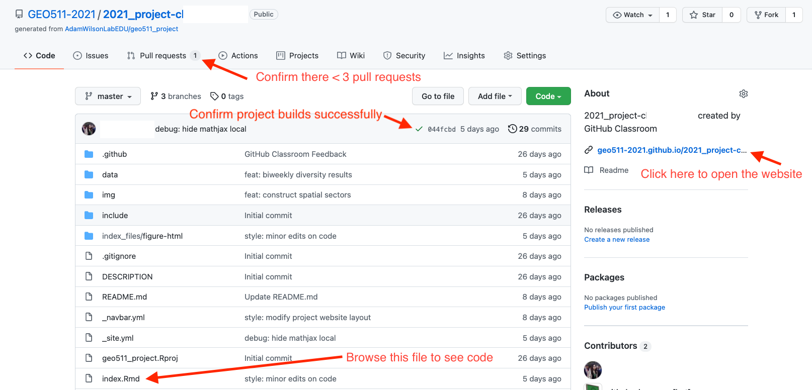

# Reading

- GitHub [Pull Requests](https://help.github.com/articles/about-pull-requests/)
- Chapter [28 in R4DS](http://r4ds.had.co.nz)

# Tasks

- Review at least two other students' projects and make comments via a _pull request_ in GitHub.

# Project Peer Evaluation

Plan to spend at least 1 hour for each review (2 hours total). The objectives for this assignment are to:

1. See what other students are doing for their final project
2. Understand how to organize code and data to make it easily reproducible (by others or your future self)
4. Learn how to provide feedback through the 'pull request' mechanism in GitHub.
3. Provide feedback to help improve other student's projects

## Instructions

### Selecting a project to evaluate

1. Browse the [current drafts of projects here](https://github.com/geo511-2020?q=project&type=&language=).  
2. Select two repositories and evaluate them according to the instructions listed in the [Project First Draft task](TK_11.html) 

### Download and reproduce the project

1) Explore the final projects in the [class repository](https://github.com/geo511-2020?q=project&type=&language=)
2) Select two projects that do not already have two evaluations (pull requests). For example, in the image above, there are 0 pull requests, so this repository would be available for you to review.  If there are already 2 pull requests, select another repository.
2) Go to the github page linked in the assignment and download the repository as a zip file (click on the  button).
3) Unzip the file after it downloads
4) Open the project or `index.Rmd` in RStudio and click `Build Website` in the `Build` tab in the upper right.
5) Evaluate whether the project meets the specifications listed in the [Project First Draft task](TK_11.html)

### Provide feedback and evaluation via pull request

After you reproduce the project, you will provide feedback via pull request.

The following video will walk you through the steps of providing feedback via a pull request.
<iframe width="560" height="315" src="https://www.youtube.com/embed/wy9EggBhC-M" frameborder="0" allow="accelerometer; autoplay; encrypted-media; gyroscope; picture-in-picture" allowfullscreen></iframe>

1) In the "Code" tab of the github page for the project, click on the file you want to provide feedback on (typically this will be `index.Rmd`)
2) Click the pencil icon on the right side to edit the file
3) You can make changes or comment on the code
   * To make changes, simply edit the text
   * To comment, you must still make some sort of change on the lines where you want to cmment.  The easiest thing is simply to add a space at the end of the line (as I do in the video above).
4) At the bottom of the file, there is a section called "Commit Changes", select the button for **Create a new branch for this commit and start a pull request.** and name the new branch `project_feedback_githubusername`
5) Click "Propose File change"
6) Click on the button "Files Changed #1" near the middle of the next page
7) Hover over lines you would like to comment on and click the little blue plus button.  Then enter your comment and select "Add single comment"
6) Repeat steps 2-6 for any additional files you want to comment on 

Be sure to install any required libraries (do not complain if it fails because you don't have a library installed).
