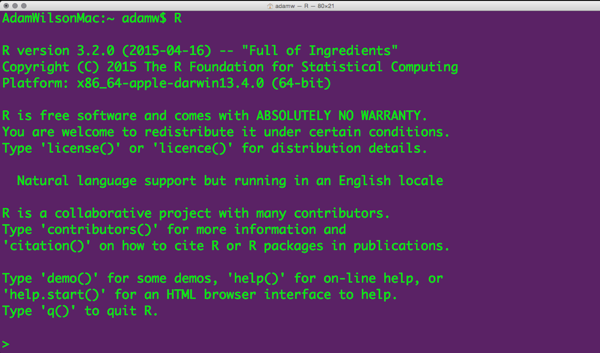
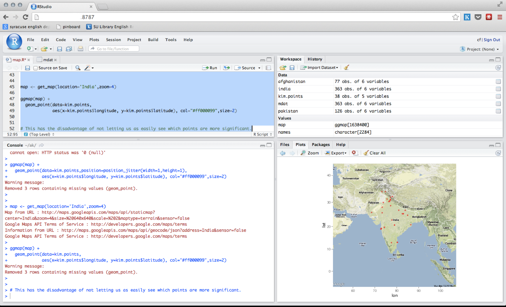
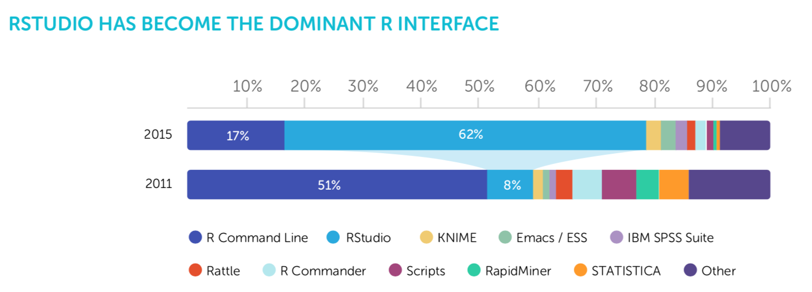
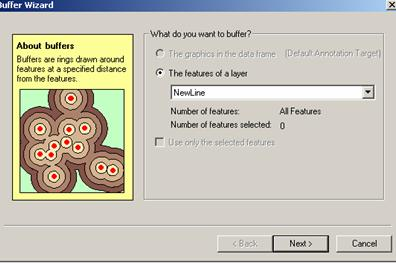
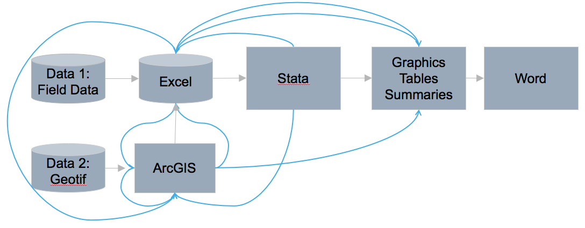
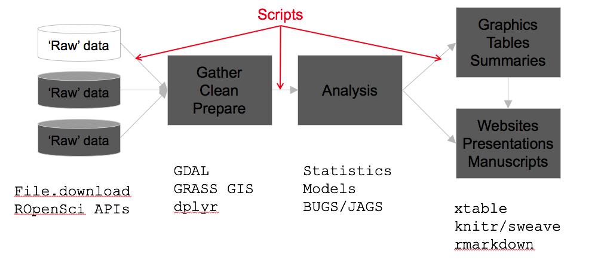
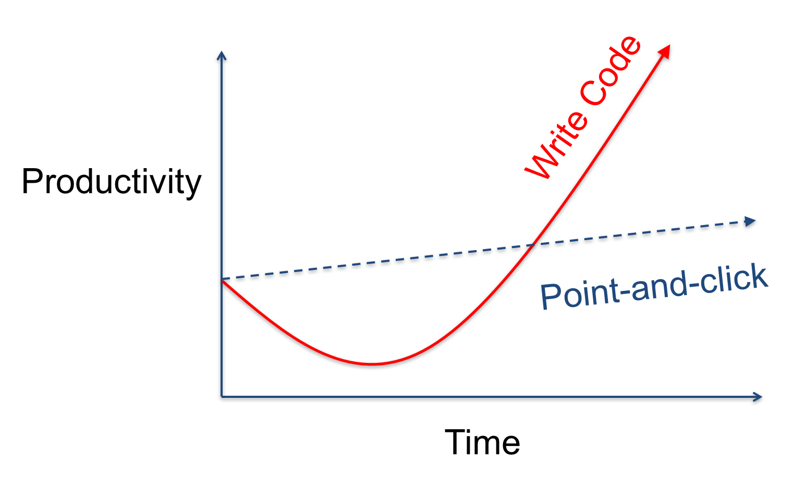
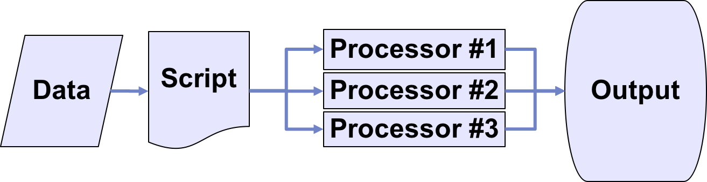

```{r child = "pres_setup.Rmd"}
```


## Today's plan
1. Who am I?
2. Who are You?
3. Course Overview
5. What is R? 
6. Who uses R?

# Introductions

## Adam M. Wilson
<div class="columns-2">
Associate Professor of Global Environmental Change<br>
Geography Department

I Use R:

* GIS 
* Statistics
* Visualizations
* HTML/Websites (including this one!)

</div>

## Who are you?

* Name
* Degree and Department 
   * _e.g. Masters in GIS in Geography_
* Something about you (< 1 minute, please)
   * Maybe:
      * Why you are taking this class
      * Something you want to learn / do
      * What you did over the summer


# Course Overview

## Spatial Data Science

</img>
--Grolemund & Wickham, R for Data Science, O'Reilly 2016

## Course Learning Objectives

1. Convert data from varied formats/structures to desired format for analysis and visualization
2. Clean, transform, and merge data attributes/variables appropriately
3. Effectively display and communicate meaning from spatial, temporal, and textual data
4. Use current analysis, presentation, and collaboration tools in the spatial data science field.

This course is NOT a statistics course (see GEO 505, etc.). 

## In other words: <br> become an R wizard!

## Tools

* R
* RStudio
* DataCamp
* Git (Version Control)

## Course Structure

<iframe
  src="https://geo511.wilsonlab.io"
  width="100%" height="800">
</iframe>
[source](http://geo511.wilsonlab.io)

## Time committment

Plan to spend approximately 5-11 hours each week:

* DataCamp courses: 3-5
* Weekly Tasks: 1
* Case Studies: 1-5
* Project will require more time near end of semester.

## Course Schedule
<iframe
  src="https://geo511.wilsonlab.io/Schedule.html"
  width="100%" height="800">
</iframe>
[source](http://geo511.wilsonlab.io/Schedule.html)


## Weekly Rhythm

1. **Preparation**   
    a. Read Assigned Material   
    b. Work on class tasks and DataCamp assignments
    c. Submit questions for class discussion on Slack
2. **Class Time Tuesday**
    a. Case Study Team Meetings, problem solving, etc.
3. **Continue Preparation**   
    a. Finish case studies and prepare to present
    d. Prepare Resource Presentation (once / semester)
4. **Class Time Thursday**   
    a. Updates & Questions from reading and daily class tasks [~10 minutes]  
    b. Student Resource Presentation(s) [20 minutes]   
    c. Case Study Presentation [30 minutes]
        * One group [randomly] selected to share solution
        * Other groups share other approaches / solutions
    d. Case Study Introduction (for following week) [20 minutes]
5. **Rinse and Repeat**   

## ~~Covid~~ Sickness Protocol

* Not able to socially-distance in classroom
* Consider wearing a mask or stay home if sick

# Academic integrity Generative AI

## Overview
The primary goal of the course is to learn how to program and think as a data scientist concerning data wrangling and visualization. I want you to use your time as efficiently as possible to meet this goal.

## Example 1

Sam uses chatGPT to generate examples of how to write a for loop and then writes their own for loop for the assignment. 

## Example 2

Alex pasted the assignment into chatGPT and then submitted the response in class. They did not understand the code and could not reproduce it on her own. 

## Example 3

Mohammed pasted the assignment into chatCPT and then used the response to learn which functions he could use and how the functions work. He submitted a version that was very similar (or identical) to chatGPT’s response, but he understood how it worked and was able to reproduce the code without AI when asked. 


## Example 4
Jon found his classmate’s repositories on Github and copy-pasted their code into his assignment and didn’t understand a few parts of it. 

## Example 5
Sumaiya was stuck on a problem and reviewed a classmate’s code for ideas. She used a few functions from the code but understood how it worked and was able to reproduce it later. 

## Overview
The primary goal of the course is to learn how to program and think as a data scientist concerning data wrangling and visualization. I want you to use your time as efficiently as possible to meet this goal.


## Tasks for this week

<iframe
  src="https://geo511.wilsonlab.io/TK_01.html"
  width="100%" height="800">
</iframe>
[source](http://geo511.wilsonlab.io/TK_01.html)

## Resource Presentations

<iframe
  src="https://geo511.wilsonlab.io/PackageIntro.html"
  width="100%" height="800">
</iframe>
[source](http://geo511.wilsonlab.io/PackageIntro.html)

## 1st Case Study ("due" next week)

<iframe
  src="https://geo511.wilsonlab.io/CS_01.html"
  width="100%" height="700">
</iframe>
[source](http://geo511.wilsonlab.io/CS_01.html)


## Groups in this course

* Groups of ~3-4 students
* Case Study #1 groups in UBlearns
* UBLearns for communication (or slack, etc. )
* Objectives:
    * build community
    * work as a team on case studies

## Group Leader Sign ups

<iframe
  src="https://buffalo.box.com/s/wtqkvrgosj6xmtcuwa5oppsj04ttymjk"
  width="100%" height="800">
</iframe>

<a href="https://buffalo.box.com/s/wtqkvrgosj6xmtcuwa5oppsj04ttymjk">link</a>
## Meet your group

* 10 minute breakout session
* Topics
   * Introduce again
   * Do you have any experience writing code? (if so, which languages, etc.)?
   * What do you hope to learn from this course?
   * Perhaps identify leader for next week (who will be prepared to explain Case Study 1)
* After ~10 minutes, we'll return to single group to summarize 

## Selecting the Case Study Presentation

<iframe
  src="https://wheelofnames.com/bw4-gdt"
  width="100%" height="800">
</iframe>


# What is R and who uses it?


## R Project for Statistical Computing

* Free and Open source
* Data manipulation
* Data analysis tools
* Great graphics
* Programming language
* 6,000+ free, community-contributed packages
* A supportive and increasing user community

R is a dialect of the S language  developed at Bell Laboratories (formerly AT&T) by John Chambers et. al. (same group developed C and UNIX©)

## What is the R environment?

* effective data handling and storage facility
* suite of operators for (vectorized) calculations
* large, coherent, integrated collection of tools for data analysis
* graphical capabilities (screen or hardcopy)
* well-developed, simple, and effective programming language which includes:
     * conditionals
     * loops
     * user defined functions
    * input and output facilities

## Custom Visualizations 

<iframe
  src="https://www.r-graph-gallery.com/"
  width="100%" height="800">
</iframe>
[source](https://www.r-graph-gallery.com/)


## Spatial Visualizations

<iframe
  src="https://www.r-graph-gallery.com/connection-map.html"
  width="100%" height="800">
</iframe>
[source](https://www.r-graph-gallery.com/connection-map.html)


## Spatial Data Processing in R

Packages: `sf, maptools, rgeos, raster, terra, ggmap`

R can perform many GIS functions and workflows (often better than a GIS!).


## Strengths & Limitations

* Just-in-time compilation
     * Slower than compiled languages (C+, etc.) <i class="fa fa-thumbs-o-down" aria-hidden="true"></i>
     * Faster to compose <i class="fa fa-thumbs-o-up" aria-hidden="true"></i> 
* Many available packages <i class="fa fa-thumbs-o-up" aria-hidden="true"></i>
* Most operations conducted in RAM
     * RAM can be limiting and/or expensive <i class="fa fa-thumbs-o-down" aria-hidden="true"></i>
     * `Error: cannot allocate vector of size X Mb`
     * Various packages and clever programming can overcome this… <i class="fa fa-thumbs-o-up" aria-hidden="true"></i>
* Free like beer **AND** speech! <i class="fa fa-thumbs-o-up" aria-hidden="true"></i>

## R Interface

</img>

But there are other options...

## RStudio

</img>

Mac, Windows, Linux, and over the web…

# Who uses R

## Popularity of Data Science Software
<iframe
  src="http://r4stats.com/articles/popularity"
  width="100%" height="800">
</iframe>
[source](http://r4stats.com/articles/popularity)


## Scholarly Articles


Number of scholarly articles found in the most recent complete year (2022) for the more popular data science software. To be included, software must be used in at least 4,500 scholarly articles.

## Interface to R


## R vs Python
<iframe
  src="https://s3.amazonaws.com/assets.datacamp.com/email/other/Python+vs+R+(1).png"
  width="100%" height="800">
</iframe>
[source](https://s3.amazonaws.com/assets.datacamp.com/email/other/Python+vs+R+(1).png)


## Many 'Cheatsheets' available

</img>

[source](https://www.rstudio.com/resources/cheatsheets/)

# Why code at all?

## Why write code when you can click?

</img>

Graphical User Interfaces are useful, especially when you are learning...

## Typical GUI Workflow
</img>

## Organized and repeatable workflow
</img>

## Learning a programming language can help you learn how to think logically.

<blockquote>
A man who does not know foreign language is ignorant of his own.
<br> -- Johann Wolfgang von Goethe (1749 - 1832)
</blockquote>

## Programming gives you access to more computer power.

<blockquote>
The computer is incredibly fast, accurate, and stupid. Man is unbelievably slow, inaccurate, and brilliant. The marriage of the two is a force beyond calculation. <br> -- Leo Cherne
</blockquote>

## From Graphical User Interface (GUI) to Scripting

</img>


## Parallel Processing
For BIG jobs:
multi-core processors / high performance computing with foreach.
</img>


# Case Study 1

```{r child = "resource_case_study.Rmd"}
```


## Case Study Motivations

1. Best way to learn something is to (prepare to) teach it
2. Develop confidence presenting your method/solution/approach
3. Learn tools for transparent collaboration

## The first 'Case Study'

* _Formative_ assessments - not tests
* Work with group mates but submit alone
* No _stupid_ questions!
* If you finish early - 
  * Ask about anything (related to the course)!
  * Start thinking about project?!?

## Do's and Don'ts

1. Don't be scared - this is a supportive environment.
2. Do share stories about _how_ you figured it out:
   * other things you tried
   * things that didn't work
3. Do mention your group mates and any contributions they made (if they did)


