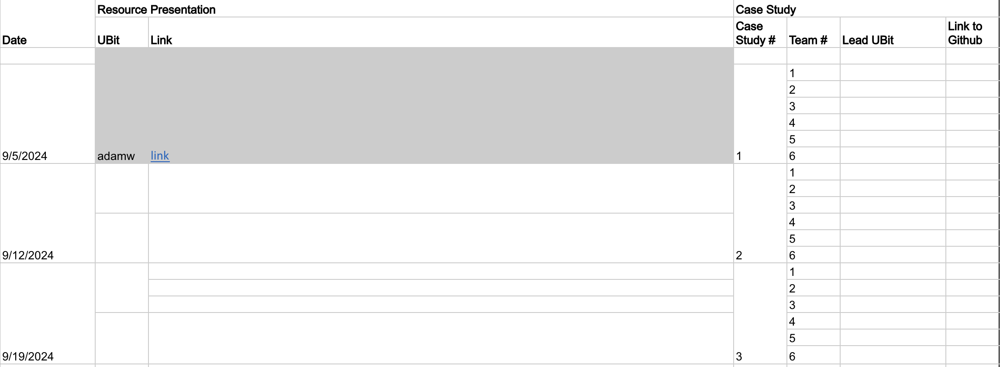

# Getting Started

## Today's agenda

1. Q&A
2. Example Resource Presentation
3. Case Study Presentations
4. Case Study Introduction

## Questions?

* Syllabus?
* Installing R and RStudio?
* Assignments?
* DataCamp?
* Other Problems?

## Getting ahead

* Datacamp - Go as far as you want!
* Case studies & tasks - Stay on schedule (sometimes I change them!)

## Course Schedule

<iframe
  src="https://geo511.wilsonlab.io/Schedule.html"
  width="100%" height="800">
</iframe>
[source](https://geo511.wilsonlab.io/Schedule.html)

## Datacamp
Recommended Deadlines

## Resource Presentations

<iframe
  src="http://geo511.wilsonlab.io/PackageIntro.html"
  width="100%" height="800">
</iframe>
[source](http://geo511.wilsonlab.io/PackageIntro.html)

# Case Study Presentations

## Case Study Motivations

1. Best way to learn something is to (prepare to) teach it
2. Develop confidence presenting your method/solution/approach
3. Learn tools for transparent collaboration

## Do's and Don'ts

1. Don't be scared - this is a supportive environment.
2. Do share stories about _how_ you figured it out:
   * other things you tried
   * things that didn't work
3. Do mention your group mates and any contributions they made (if they did)

## Resource Presentations

[source](https://buffalo.box.com/s/wtqkvrgosj6xmtcuwa5oppsj04ttymjk)

## Case Study Presentations -  Let's pick a winner!

<iframe src="https://wheelofnames.com/ssm-wwz" width="100%" height="500"> </iframe>
<a href=https://buffalo.box.com/s/wtqkvrgosj6xmtcuwa5oppsj04ttymjk"> show spreadsheet </a>

<!-- <iframe src="https://buffalo.box.com/s/wtqkvrgosj6xmtcuwa5oppsj04ttymjk" width="800" height="100" frameborder="0" allowfullscreen webkitallowfullscreen msallowfullscreen></iframe> -->

## Writing Code

You are doing two things at the same time:

1. accomplishing some task _now_
2. collaborating with your future self (or someone else) 

SO:

1. Include lots of comments to understand and repeat what you did
2. Remember to clean up your code when you've finished!
3. Consider the style guide...

## Style Guide

<iframe
  src="https://style.tidyverse.org/"
  width="100%" height="800">
</iframe>
[source](https://style.tidyverse.org/)

## Next Week's Case Study

<iframe
  src="http://geo511.wilsonlab.io/CS_02.html"
  width="100%" height="800">
</iframe>
[source](http://geo511.wilsonlab.io/CS_02.html)

