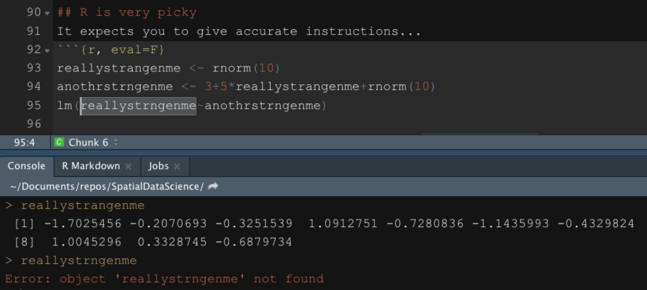
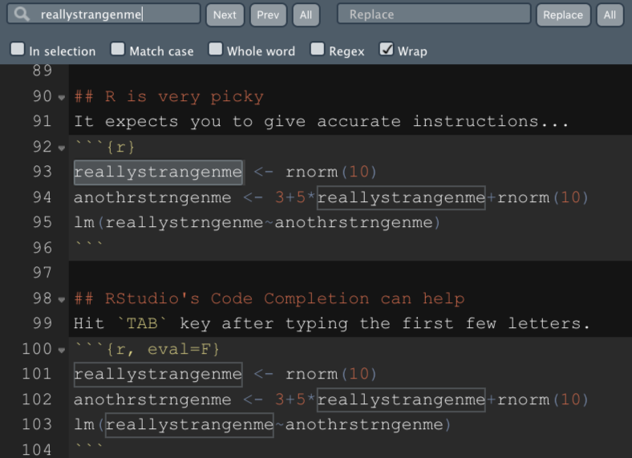
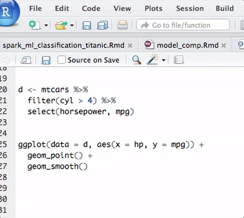
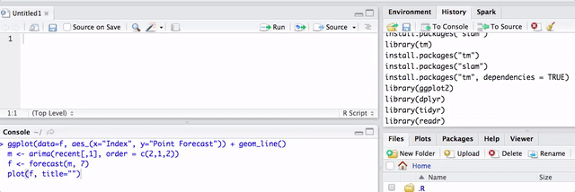
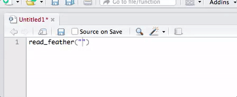

---


## Course Schedule

<iframe
  src="https://geo511.wilsonlab.io/Schedule.html"
  width="100%" height="800">
</iframe>
[source](https://geo511.wilsonlab.io/Schedule.html)

## Resource Presentations

<iframe
  src="https://docs.google.com/spreadsheets/d/e/2PACX-1vQJhWvxt2xNq8t0SWWfUKM5Th3aT_bJWfL71Zoyf1JbysDknpfGfInw8_SonjhivIyRMC3DPfa-1fLm/pubhtml?gid=868447735&single=true"
  width="100%" height="800">
</iframe>
[source](https://docs.google.com/spreadsheets/d/e/2PACX-1vQJhWvxt2xNq8t0SWWfUKM5Th3aT_bJWfL71Zoyf1JbysDknpfGfInw8_SonjhivIyRMC3DPfa-1fLm/pubhtml?gid=868447735&single=true)

## Case Study Presentations -  Let's pick a winner!

<iframe
  src="https://wheelofnames.com/4tc-n5n"
  width="100%" height="500">
</iframe>
<iframe src="https://docs.google.com/spreadsheets/d/e/2PACX-1vQJhWvxt2xNq8t0SWWfUKM5Th3aT_bJWfL71Zoyf1JbysDknpfGfInw8_SonjhivIyRMC3DPfa-1fLm/pubhtml?gid=868447735&single=true" style="height: 800px; width: 100%;"></iframe>

## Project Proposal Example

[Example 1: Colin](https://github.com/geo511-2020/geo511-2020-tasks-coconn41/blob/master/Final_Project/Project_Proposal.md)

[Example 2: Erik](https://github.com/geo511-2020/geo511-2020-tasks-erikwoyc/blob/master/week_07/Project_Proposal.md)


## Next Week's Case Study

<iframe
  src="https://geo511.wilsonlab.io/CS_07.html"
  width="100%" height="800">
</iframe>
[source](https://geo511.wilsonlab.io/CS_07.html)

## Got Problems?


# Strange Errors

## Examples from Stack Overflow
This is the error messages I get...

```r
> setwd("H:/user/george")
"Error: unexpected input in "setwd("H:/XX/XXX")
"Error: unexpected input in "
> GWS <- read.csv("X.csv", header = TRUE, sep = ",", stringsAsFactors =
FALSE, na.strings=c("","","NA"))
"Error: unexpected input in "GWS <- read.csv("X.csv", header = TRUE, sep =
",", stringsAsFactors = FALSE, na.strings=c("","","NA"))
> GWS <- GWS[with(GWS, order(d)), ]; row.names(GWS) <- NULL
Error: object 'GWS' not found
```


## Another one


"Help, I'm getting an error and I don't know what it means"

```r
> lm1=lm(cr~tn,data=x)
Error in lm.fit(x, y, offset = offset, singular.ok = singular.ok, ...) : 
  NA/NaN/Inf in 'y'
In addition: Warning message:
In storage.mode(v) <- "double" : NAs introduced by coercion
```

# Finding Help

## Basic Resources

[Getting Help with R](https://www.r-project.org/help.html)

<iframe width="100%" height="500px" src='https://www.r-project.org/help.html'></iframe>


## Help Files
<iframe width="100%" height="500px" src='https://www.rdocumentation.org/packages/base/versions/3.5.1/topics/mean'></iframe>


## Vignettes

[sf: Simple Features for R](https://cran.r-project.org/web/packages/sf/index.html)

<div class='embed-responsive embed-responsive'>
<iframe class='embed-responsive-item' width="100%" height="500px" src='https://cran.r-project.org/web/packages/sf/index.html' allowfullscreen></iframe>
</div>

# Effective Problem Solving

## Step one: Break down your problem

* Break down your code (run bit by bit)!
* Understand the data/inputs
* Read the help files carefully
* Try `traceback()`

## R is very picky
It expects you to give accurate instructions...

```r
reallystrangenme <- rnorm(10)
anothrstrngenme <- 3+5*reallystrangenme+rnorm(10)
lm(reallystrngenme~anothrstrngenme)
```

>* `# Error: object 'reallystrngenme' not found`

## Break down your code
Run bit by bit:



## traceback
Prints the call stack of the last uncaught error, i.e., the sequence of calls that lead to the error. This is useful when an error occurs with an unidentifiable error message.


```r
pets=c("dog","cat","fish")
lm(pets~1:5)

Error in terms.formula(formula, data = data) :
  invalid model formula in ExtractVars

traceback()

 7: terms.formula(formula, data = data)
 6: terms(formula, data = data)
 5: model.frame.default(formula = pets ~ 1:5, drop.unused.levels = TRUE)
 4: stats::model.frame(formula = pets ~ 1:5, drop.unused.levels = TRUE)
 3: eval(mf, parent.frame())
 2: eval(mf, parent.frame())
 1: lm(pets ~ 1:5)
```

# RStudio features can help

## TAB completion
Hit `TAB` key after typing the first few letters.

```r
lm(reallystrangenme~anothrstrngenme)
```

## "Find"
Or use ctrl-F to 'find' variables with the same name.


## Rename in Scope
Rename all instances of a variable. Tool is context aware; changing ’m’ to ‘m1’ won’t change ‘mtcars’ to ‘m1tcars’.



## Command History
Scroll through the command history by clicking Ctrl/Cmd and ↑, then filter by typing.


## History Pane
Searchable list of past commands. Commands can be written to the source pane or the console. 



## File Navigation
Tab complete can find files and remove the hassle of writing out long path locations. Hit tab in between two double quotes (” “) to open a file explorer.



## Debugging
[Debugging in RStudio](https://support.rstudio.com/hc/en-us/articles/205612627-Debugging-with-RStudio)

1. Begin running the code
2. Stop the code at the point where you suspect the problem is arising, and
3. Look at and/or walk through the code, step-by-step at that point.

# Building a workflow

## Grandma's Recipe Book

>* Grandma makes our favorite chocolate chip cookies and we ask for her to write down recipe
>* Grandma writes the recipe
>* We make a batch and they are awful!
>* Grandma makes another batch and they are delicious!
>* We go the recipe again to find the error
>* Grandma says, "Well you didn't add the sugar, of course you need about 2 cups of sugar!" 
>* No sugar in the recipe!
>* Always, always, always think about the 'flow' of the script.

## Your script is your product


## "It worked before, but now it doesn't"

Possible explanations:

* Running commands in a different order
* Skipping commands
* Missing/incorrect/conflicts with packages
* Different objects in environment (playing on the console?)

---


```r
library(spData); library(rasterVis)
data(elev)
# change values!=20 to NA
elev=mask(elev,mask = elev==20, maskvalue=0) 
gplot(elev)+geom_raster(aes(fill=value))
```


```r
distance_to_20=distance(elev)  #works fine
data(elev)
gplot(distance_to_20)+ geom_raster(aes(fill=value))
```


```r
distance_to_20=distance(elev) #returns an error:
Error in .local(x, y, ...) : 
RasterLayer has no NA cells (for which to compute a distance)
```

## Goals while coding

1. Figure out how to complete your task
2. Build the script that will do it again (and again)

## Suggestions for building clean scripts

1. Try to keep your script 'clean' - it should always run from beginning to end
2. Comment exploratory lines such as `View(iris)`, `str(iris)`, etc.
  
  ```r
  # str(iris)
  ```

3. If you want a little playground, try 
  
  ```r
  if(F){
  View(iris)
  str(iris)
  }
  ```
4. Use the console (lower left) for testing, quick plots, temporary things.
5. Never do something important in the console without putting it in the script.

# Asking for help

## R's Community

R has a large and generous community of users, help them help you.

## "Issue" posted on tidyr's github page:
[Separate() causes R to crash with fatal error](https://github.com/tidyverse/tidyr/issues/297)
I have 11 primary variables, each one appears in the dataset in 72 columns: once for each month, for 6 years. Each variable name ends in ".YYYY_M", where YYYY is a 4-digit year and M is month.


```r
> vnms <- names(outs_TN_wide)
> vars_tv <- grepl("20[01]\\d", vnms)

> outs_TN_long <- outs_TN_wide %>%
  gather(Variable, Value, one_of(vnms[vars_tv])) %>%
  separate(Variable, c("Variable", "Time"), sep = "\\.")

R encountered a fatal error./The session was terminated.
```

## Jun 23, 2017 @hadley replies
"Can you please provide a minimal reprex (reproducible example)? The goal of a reprex is to make it as easy as possible for me to recreate your problem so that I can fix it: please help me help you!  If you've never heard of a reprex before, start by reading ["What is a reprex"](http://reprex.tidyverse.org/articles/reprex.html)..."


## Nov 14, 2017 @hadley closes this issue
I've closed this issue due to lack of requested reprex. If you still care about this bug, please open a new issue with a reprex.

### The more helpful you are, the more likely you will get help.  

## Build a Reproducible Example (REPREX) 

Break the problem down to the simplest possible illustation (preferably using built-in datasets).  

## REPREX package
Write a bit of code and copy it to the clipboard:


```r
y <- 1:4
mean(y)
```
Type `reprex()` in the R Console. In RStudio, you’ll see a preview of your rendered reprex:


```r
y <- 1:4
#> [1] 1 2 3 4
mean(y)
#> [1] 2.5
```

Paste it into GitHub issue, StackOverflow, email, etc.

## This is a lot of work!
Yes! You are asking other people to do work too. It’s a partnership.

* You will often solve your own problem while developing the reprex!
* If you don't, you will create a reprex that will help others help you!

## General Questions: Stack Overflow

<iframe
  src="https://stackoverflow.com/questions/tagged/r"
  width="100%" height="800">
</iframe>
[source](https://stackoverflow.com/questions/tagged/r)


## Specific Bug / Feature Request
Github "Issues"

<iframe
  src="https://github.com/tidyverse/tidyr/issues"
  width="100%" height="800">
</iframe>
[source](https://github.com/tidyverse/tidyr/issues)

## Next week

**Bring Project-related questions**

Case study is an easy one and there will be extra time!
