## Course Schedule
<iframe
  src="http://geo511.wilsonlab.io/Schedule.html"
  width="100%" height="800">
</iframe>
[source](http://geo511.wilsonlab.io/Schedule.html)


## Final Projects

* Only 8 folks have published their sites...
* Start moving your project proposal content into your website
  * Title
  * Introduction
  * etc...


## Resource Presentations

<iframe
  src="https://docs.google.com/spreadsheets/d/e/2PACX-1vQJhWvxt2xNq8t0SWWfUKM5Th3aT_bJWfL71Zoyf1JbysDknpfGfInw8_SonjhivIyRMC3DPfa-1fLm/pubhtml?gid=868447735&single=true"
  width="100%" height="800">
</iframe>
[source](https://docs.google.com/spreadsheets/d/e/2PACX-1vQJhWvxt2xNq8t0SWWfUKM5Th3aT_bJWfL71Zoyf1JbysDknpfGfInw8_SonjhivIyRMC3DPfa-1fLm/pubhtml?gid=868447735&single=true)

## Case Study Presentations -  Let's pick a winner!

<iframe
  src="https://wheelofnames.com/bw4-gdt"
  width="100%" height="500">
</iframe>
<iframe src="https://docs.google.com/spreadsheets/d/e/2PACX-1vQJhWvxt2xNq8t0SWWfUKM5Th3aT_bJWfL71Zoyf1JbysDknpfGfInw8_SonjhivIyRMC3DPfa-1fLm/pubhtml?gid=868447735&single=true" style="height: 800px; width: 100%;"></iframe>


## Next Week's Case Study

<iframe
  src="http://wilsonlab.io/GEO511/CS_09.html"
  width="100%" height="800">
</iframe>
[source](http://wilsonlab.io/GEO511/CS_09.html)


# API

## Application Programming Interface

<iframe src="https://en.wikipedia.org/wiki/Application_programming_interface" width=100% height=400px></iframe>

> - Imagine I wanted to work with Wikipedia content...

## Manually processing information from the web

* Browse to page, `File->Save As`, repeat.
* Deal with ugly html stuff...

```{}
<!DOCTYPE html>
<html>
<head>
  <meta charset="utf-8">
  <meta name="generator" content="pandoc">
  <title>APIs, time-series, and weather Data</title>
  <meta name="apple-mobile-web-app-capable" content="yes">
  <meta name="apple-mobile-web-app-status-bar-style" content="black-translucent">
  <meta name="viewport" content="width=device-width, initial-scale=1.0, maximum-scale=1.0, user-scalable=no, minimal-ui">
  <link rel="stylesheet" href="externals/reveal.js-3.3.0.1/css/reveal.css"/>
```

---


```r
library(WikipediR)
library(tidyverse)

content=page_content(
  page_name = "Application_programming_interface",
  project="Wikipedia",
  language="en",
  as_wikitext=T)
```

## APIs allow direct (and often custom) sharing of data

```r
c1=content$parse$wikitext%>%
  str_split(boundary("sentence"),simplify = T)%>%
  str_replace_all("'","")%>%
  str_replace_all("\\[|\\]","")
# results:
cat(c1[3:4])
```

```
## NA NA
```

## Many data providers now have APIs

* Government Demographic data (census, etc.)
* Government Environmental data
* Google, Twitter, etc.

## ROpenSci

<iframe
  src="https://ropensci.org"
  width="100%" height="800">
</iframe>
[source](https://ropensci.org)


## Pros & Cons

### Pros
* Get the data you want, when you want it
* Automatic updates - just re-run the request

### Cons
* Dependent on real-time access
* APIs, permissions, etc. can change and break code

## Generic API Access
1. Provide R with a URL to request information
2. The API sends you back a response
    * JavaScript Object Notation (JSON)
    * Extensible Markup Language (XML). 
    

```r
library(tidyverse)
library(httr)
library(jsonlite)
```

## Endpoints
The URL you will request information from. 

* Data.gov API: https://www.data.gov/developers/apis
* Github API: https://api.github.com
* U.S. Census API:  http://api.census.gov


## Some R Packages for specific APIs

## Census data

```r
library(tidycensus)

net_migration <- get_estimates(geography = "county",
                               variables = "RNETMIG",
                               geometry = TRUE,
                               shift_geo = TRUE)


net_migration <- net_migration %>%
  mutate(groups = case_when(
    value > 15 ~ "+15 and up",
    value > 5 ~ "+5 to +15",
    value > -5 ~ "-5 to +5",
    value > -15 ~ "-15 to -5",
    TRUE ~ "-15 and below"
  ))

ggplot() +
  geom_sf(data = net_migration, aes(fill = groups, color = groups), lwd = 0.1) +
  geom_sf(data = tidycensus::state_laea, fill = NA, color = "black", lwd = 0.1) +
  scale_fill_brewer(palette = "PuOr", direction = -1) +
  scale_color_brewer(palette = "PuOr", direction = -1, guide = FALSE) +
  coord_sf(datum = NA) +
  labs(title = "Net migration per 1000 residents by county",
       subtitle = "US Census Bureau 2017 Population Estimates",
       fill = "Rate",
       caption = "Data acquired with the R tidycensus package")
```

## Results


```
## Warning: The `shift_geo` argument is deprecated and will be removed in a future release. We
## recommend using `tigris::shift_geometry()` instead.
```

```
## Warning: It is deprecated to specify `guide = FALSE` to remove a guide. Please use `guide = "none"`
## instead.
```

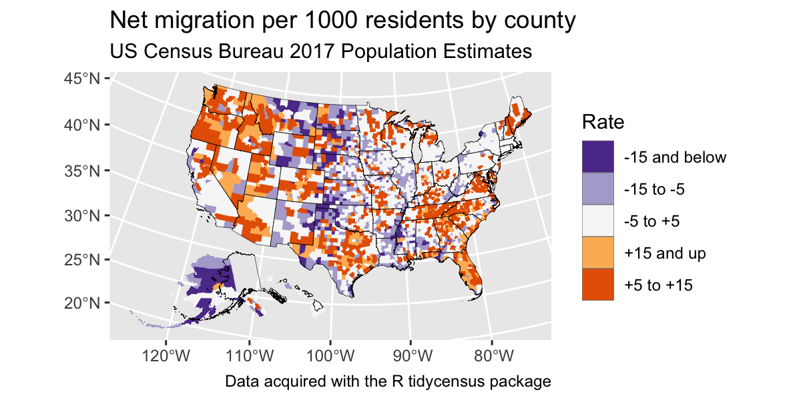

## `FedData` package

* National Elevation Dataset digital elevation models (1 and 1/3 arc-second; USGS)
* National Hydrography Dataset (USGS)
* Soil Survey Geographic (SSURGO) database 
* International Tree Ring Data Bank.
* Global Historical Climatology Network (GHCN)
* Others

## NOAA APIv2

<iframe src="https://www.ncdc.noaa.gov/cdo-web/webservices/v2" width=100% height=400px></iframe>

[National Climatic Data Center application programming interface (API)]( http://www.ncdc.noaa.gov/cdo-web/webservices/v2). 

## `rNOAA` package

Handles downloading data directly from NOAA APIv2.

* `buoy_*`  NOAA Buoy data from the National Buoy Data Center
* `ghcnd_*`  GHCND daily data from NOAA
* `isd_*` ISD/ISH data from NOAA
* `homr_*` Historical Observing Metadata Repository
* `ncdc_*` NOAA National Climatic Data Center (NCDC)
* `seaice` Sea ice
* `storm_` Storms (IBTrACS)
* `swdi` Severe Weather Data Inventory (SWDI)
* `tornadoes` From the NOAA Storm Prediction Center

# Global Historical Climatology Network (GHCN)

## Libraries


```r
library(sf)
library(broom)
library(tidyverse)
library(ggmap)
library(scales)
# New Packages
library(rnoaa)
library(climdex.pcic)
library(zoo)
```

## Station locations 

Download the GHCN station inventory with `ghcnd_stations()` and convert to `sf` object.  The download can take a minute or two.


```r
st = ghcnd_stations()%>%
  na.omit()%>%  # remove records with missing values
  st_as_sf(coords=c("longitude","latitude"))%>% #convert to sf
  st_set_crs("+proj=longlat +ellps=WGS84 +datum=WGS84 +no_defs")
```

```
## using cached file: ~/Library/Caches/R/noaa_ghcnd/ghcnd-stations.rds
```

```
## date created (size, mb): 2021-08-29 22:53:46 (2.142)
```

```
## using cached file: ~/Library/Caches/R/noaa_ghcnd/ghcnd-inventory.rds
```

```
## date created (size, mb): 2021-08-29 22:54:22 (2.638)
```

```r
  head(st)%>%kable()
```


|id          | elevation|state |name                  |gsn_flag |wmo_id |element | first_year| last_year|geometry                 |
|:-----------|---------:|:-----|:---------------------|:--------|:------|:-------|----------:|---------:|:------------------------|
|ACW00011604 |      10.1|      |ST JOHNS COOLIDGE FLD |         |       |TMAX    |       1949|      1949|POINT (-61.7833 17.1167) |
|ACW00011604 |      10.1|      |ST JOHNS COOLIDGE FLD |         |       |TMIN    |       1949|      1949|POINT (-61.7833 17.1167) |
|ACW00011604 |      10.1|      |ST JOHNS COOLIDGE FLD |         |       |PRCP    |       1949|      1949|POINT (-61.7833 17.1167) |
|ACW00011604 |      10.1|      |ST JOHNS COOLIDGE FLD |         |       |SNOW    |       1949|      1949|POINT (-61.7833 17.1167) |
|ACW00011604 |      10.1|      |ST JOHNS COOLIDGE FLD |         |       |SNWD    |       1949|      1949|POINT (-61.7833 17.1167) |
|ACW00011604 |      10.1|      |ST JOHNS COOLIDGE FLD |         |       |PGTM    |       1949|      1949|POINT (-61.7833 17.1167) |

## GHCND Variables: 5 core values

* **PRCP** Precipitation (tenths of mm)
* **SNOW** Snowfall (mm)
* **SNWD** Snow depth (mm)
* **TMAX** Maximum temperature
* **TMIN** Minimum temperature

---

### And ~50 others!  For example:

* **ACMC** Average cloudiness midnight to midnight from 30-second ceilometer 
* **AWND** Average daily wind speed
* **FMTM** Time of fastest mile or fastest 1-minute wind
* **MDSF** Multiday snowfall total

## `filter()` to temperature and precipitation

```r
st_filtered=dplyr::filter(st,element%in%c("TMAX","TMIN","PRCP"))
```

## Map GHCND stations

First, get a global country polygon

```r
library(spData)
data(world)
```

## Station locations

```r
map1=ggplot() +
  geom_sf(data=world,inherit.aes = F,size=.1,fill="grey",colour="black")+
  facet_wrap(~element)+
  stat_bin2d(data=st_filtered,
             aes(y=st_coordinates(st_filtered)[,2],
                 x=st_coordinates(st_filtered)[,1]),bins=100)+
  scale_fill_distiller(palette="YlOrRd",trans="log",direction=-1,
                       breaks = c(1,10,100,1000))+
  coord_sf()+
  labs(x="",y="")
```

---

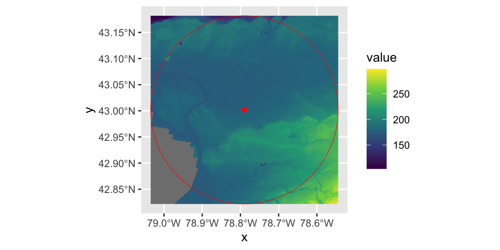

## Download daily data from GHCN

`ghcnd()` will download a `.dly` text file for a particular station.  But how to choose?

## `geocode` in ggmap package useful for geocoding place names 
Geocodes a location (find latitude and longitude) using either (1) the Data Science Toolkit (http://www.datasciencetoolkit.org/about) or (2) Google Maps. 


```r
geocode("University at Buffalo, NY")
```

```
## # A tibble: 1 x 2
##     lon   lat
##   <dbl> <dbl>
## 1 -78.8  43.0
```

---

However, you have to be careful:

```r
geocode("Washington")
```

```
## # A tibble: 1 x 2
##     lon   lat
##   <dbl> <dbl>
## 1 -121.  47.8
```

```r
geocode("Washington D.C.")
```

```
## # A tibble: 1 x 2
##     lon   lat
##   <dbl> <dbl>
## 1 -77.0  38.9
```

---

But this is pretty safe for well known and well-defined places.

```r
buffalo_c=geocode("Buffalo International Airport, NY")
buffalo_c
```

```
## # A tibble: 1 x 2
##     lon   lat
##   <dbl> <dbl>
## 1 -78.7  42.9
```

```r
buffalo=buffalo_c%>%
  st_as_sf(coords=c(1,2))%>% #convert to sf
  st_set_crs("+proj=longlat +ellps=WGS84 +datum=WGS84 +no_defs")
```

---

Now use that location to spatially filter stations.

```r
buffalo_b=st_buffer(buffalo, 0.1) #radius of buffer in decimal degrees
st1=st_within(st_filtered,buffalo_b)%>% #find stations in the buffered polygon
  apply(1, any) 
str(st1)
```

```
##  logi [1:196634] FALSE FALSE FALSE FALSE FALSE FALSE ...
```

```r
kable(st_filtered[st1,])
```


|id | elevation|state |name |gsn_flag |wmo_id |element | first_year| last_year|geometry |
|:--|---------:|:-----|:----|:--------|:------|:-------|----------:|---------:|:--------|

---

With the station ID, we can download daily data from NOAA.


```r
d=meteo_pull_monitors(monitors=c("USW00014733"),
                   var = c("TMAX","TMIN","PRCP"),
                   keep_flags = T)
```

```
## using cached file: ~/Library/Caches/R/noaa_ghcnd/USW00014733.dly
```

```
## date created (size, mb): 2021-08-29 22:58:37 (8.5)
```

```
## file min/max dates: 1938-05-01 / 2021-08-31
```

```r
head(d)%>%kable()
```


|id          |date       |mflag_prcp |mflag_tmax |mflag_tmin |prcp |qflag_prcp |qflag_tmax |qflag_tmin |sflag_prcp |sflag_tmax |sflag_tmin |tmax |tmin |
|:-----------|:----------|:----------|:----------|:----------|:----|:----------|:----------|:----------|:----------|:----------|:----------|:----|:----|
|USW00014733 |1938-05-01 |T          |           |           |0    |           |           |           |0          |0          |0          |144  |39   |
|USW00014733 |1938-05-02 |T          |           |           |0    |           |           |           |0          |0          |0          |211  |83   |
|USW00014733 |1938-05-03 |           |           |           |25   |           |           |           |0          |0          |0          |167  |72   |
|USW00014733 |1938-05-04 |           |           |           |112  |           |           |           |0          |0          |0          |206  |94   |
|USW00014733 |1938-05-05 |T          |           |           |0    |           |           |           |0          |0          |0          |311  |106  |
|USW00014733 |1938-05-06 |           |           |           |64   |           |           |           |0          |0          |0          |194  |78   |

---

See [CDO Daily Description](http://www1.ncdc.noaa.gov/pub/data/cdo/documentation/GHCND_documentation.pdf) and raw [GHCND metadata](http://www1.ncdc.noaa.gov/pub/data/ghcn/daily/readme.txt) for more details.  


## Quality Control: MFLAG

Measurement Flag/Attribute

* **Blank** no measurement information applicable
* **B** precipitation total formed from two twelve-hour totals
* **H** represents highest or lowest hourly temperature (TMAX or TMIN) or average of hourly values (TAVG)
* **K** converted from knots
* ...

See [CDO Description](http://www1.ncdc.noaa.gov/pub/data/cdo/documentation/GHCND_documentation.pdf) 

## Quality Control: QFLAG

* **Blank** did not fail any quality assurance check 
* **D** failed duplicate check
* **G** failed gap check
* **I** failed internal consistency check
* **K** failed streak/frequent-value check
* **N** failed naught check
* **O** failed climatological outlier check
* **S** failed spatial consistency check
* **T** failed temporal consistency check
* **W** temperature too warm for snow
* ...

See [CDO Description](http://www1.ncdc.noaa.gov/pub/data/cdo/documentation/GHCND_documentation.pdf) 

## Quality Control: SFLAG

Indicates the source of the data...

## Summarize QC flags

Summarize the QC flags.  How many of which type are there?  Should we be more conservative?


```r
table(d$qflag_tmin)  
```

```
## 
##           G     I     S 
## 30427     2     7     3
```
* **G** failed gap check
* **I** failed internal consistency check
* **S** failed spatial consistency check

---

### Filter with QC data and change units

```r
d_filtered=d%>%
  mutate(tmax=ifelse(qflag_tmax!=" "|tmax==-9999,NA,as.numeric(tmax)/10))%>%  # convert to degrees C
  mutate(tmin=ifelse(qflag_tmin!=" "|tmin==-9999,NA,as.numeric(tmin)/10))%>%  # convert to degrees C
  mutate(prcp=ifelse(qflag_prcp!=" "|prcp==-9999,NA,as.numeric(prcp)))%>% 
  arrange(date)
```

---

Plot temperatures

```r
ggplot(d_filtered,
       aes(y=tmax,x=date))+
  geom_line(col="red")+
  facet_wrap(~id)
```


---

Limit to a few years and plot the daily range and average temperatures.

```r
d_filtered_recent=filter(d_filtered,date>as.Date("2017-01-01"))

  ggplot(d_filtered_recent,
         aes(ymax=tmax,ymin=tmin,x=date))+
    geom_ribbon(col="grey",fill="grey")+
    geom_line(aes(y=(tmax+tmin)/2),col="red")
```

```
## Warning: Removed 4 row(s) containing missing values (geom_path).
```

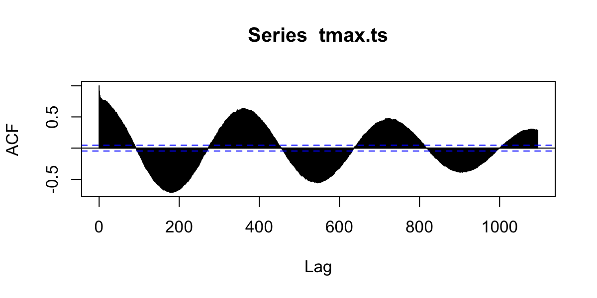

## Zoo package for rolling functions

Infrastructure for Regular and Irregular Time Series (Z's Ordered Observations)

* `rollmean()`:  Rolling mean
* `rollsum()`:   Rolling sum
* `rollapply()`:  Custom functions

Use rollmean to calculate a rolling 60-day average. 

* `align` whether the index of the result should be left- or right-aligned or centered

---


```r
d_rollmean = d_filtered_recent %>% 
  arrange(date) %>%
  mutate(tmax.60 = rollmean(x = tmax, 60, align = "center", fill = NA),
         tmax.b60 = rollmean(x = tmax, 60, align = "right", fill = NA))
```

---


```r
d_rollmean%>%
  ggplot(aes(ymax=tmax,ymin=tmin,x=date))+
    geom_ribbon(fill="grey")+
    geom_line(aes(y=(tmin+tmax)/2),col=grey(0.4),size=.5)+
    geom_line(aes(y=tmax.60),col="red")+
    geom_line(aes(y=tmax.b60),col="darkred")
```

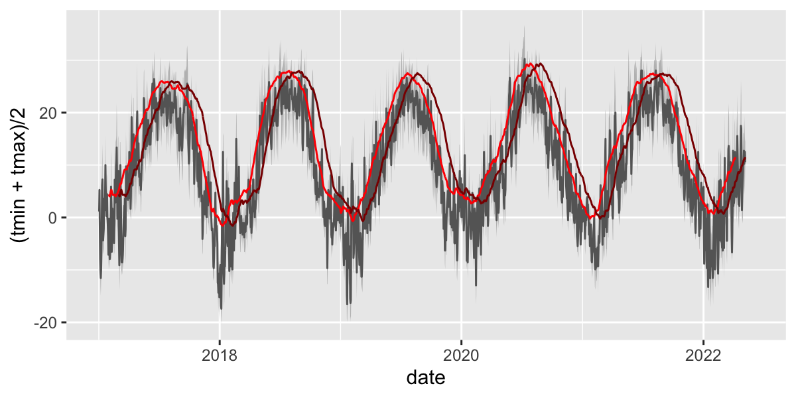

# Time Series analysis

Most timeseries functions use the time series class (`ts`)


```r
tmin.ts=ts(d_filtered_recent$tmin,frequency = 365)
```

## Temporal autocorrelation

Values are highly correlated!


```r
ggplot(d_filtered_recent,aes(y=tmin,x=lag(tmin)))+
  geom_point()+
  geom_abline(intercept=0, slope=1)
```

```
## Warning: Removed 5 rows containing missing values (geom_point).
```

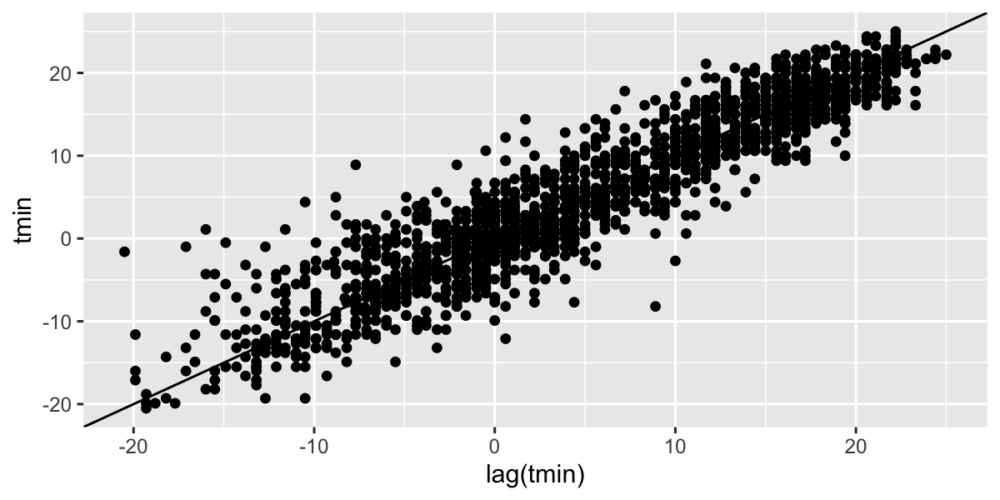

## Autocorrelation functions

* autocorrelation  $x$ vs. $x_{t-1}$  (lag=1)
* partial autocorrelation.  $x$  vs. $x_{n}$ _after_ controlling for correlations $\in t-1:n$

## Autocorrelation

```r
acf(tmin.ts,lag.max = 365*3,na.action = na.exclude )
```

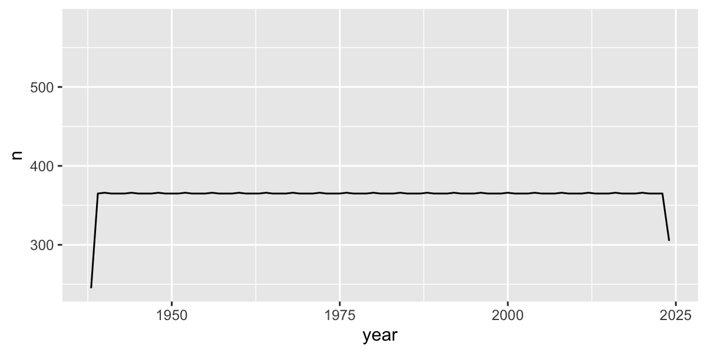

---

### Partial Autocorrelation

```r
pacf(tmin.ts,lag.max = 365,na.action = na.exclude )
```

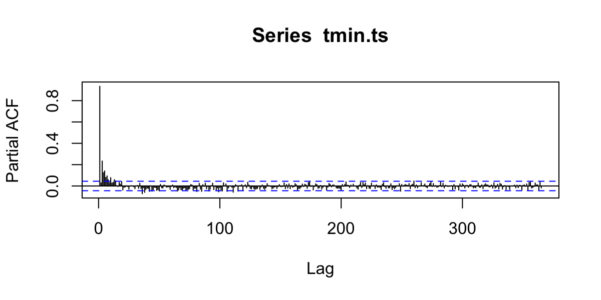


# Trend analysis

## Group by month, season, year, and decade.

How to convert years into 'decades'?

```r
1938
```

```
## [1] 1938
```

```r
round(1938,-1)
```

```
## [1] 1940
```

```r
floor(1938/10)
```

```
## [1] 193
```

```r
floor(1938/10)*10 
```

```
## [1] 1930
```
Now we can make a 'decade' grouping variable.

---

Calculate seasonal and decadal mean temperatures.

```r
d_filtered2=d_filtered%>%
  mutate(month=as.numeric(format(date,"%m")),
        year=as.numeric(format(date,"%Y")),
        season=case_when(
          month%in%c(12,1,2)~"Winter",
          month%in%c(3,4,5)~"Spring",
          month%in%c(6,7,8)~"Summer",
          month%in%c(9,10,11)~"Fall"),
        dec=(floor(as.numeric(format(date,"%Y"))/10)*10))
d_filtered2%>%dplyr::select(date,month,year,season,dec,tmax)%>%head()%>%kable()
```


|date       | month| year|season |  dec| tmax|
|:----------|-----:|----:|:------|----:|----:|
|1938-05-01 |     5| 1938|Spring | 1930| 14.4|
|1938-05-02 |     5| 1938|Spring | 1930| 21.1|
|1938-05-03 |     5| 1938|Spring | 1930| 16.7|
|1938-05-04 |     5| 1938|Spring | 1930| 20.6|
|1938-05-05 |     5| 1938|Spring | 1930| 31.1|
|1938-05-06 |     5| 1938|Spring | 1930| 19.4|

## Timeseries models


How to assess change? Simple differences?


```r
d_filtered2%>%
  mutate(period=ifelse(year<=1976-01-01,"early","late"))%>% #create two time periods before and after 1976
  group_by(period)%>%  # divide the data into the two groups
  summarize(n=n(),    # calculate the means between the two periods
            tmin=mean(tmin,na.rm=T),
            tmax=mean(tmax,na.rm=T),
            prcp=mean(prcp,na.rm=T))%>%
  kable()
```


|period |     n|     tmin|     tmax|     prcp|
|:------|-----:|--------:|--------:|--------:|
|early  | 13394| 4.200516| 13.67306| 25.09372|
|late   | 17045| 4.817294| 13.77652| 28.51288|

---

But be careful, there were lots of missing data in the beginning of the record

```r
d_filtered2%>%
  group_by(year)%>%
  summarize(n=n())%>%
  ggplot(aes(x=year,y=n))+
  geom_line()
```

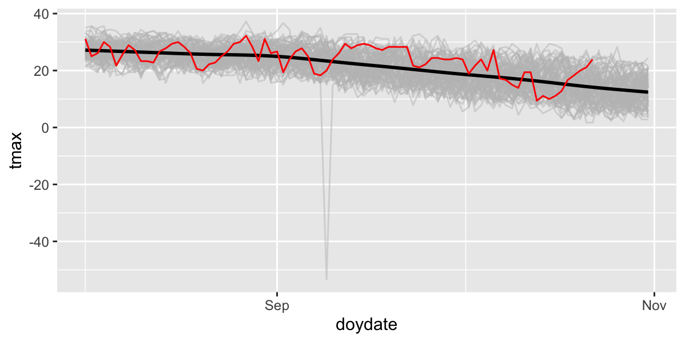

---


```r
# which years don't have complete data?
d_filtered2%>%
  group_by(year)%>%
  summarize(n=n())%>%
  filter(n<360)
```

```
## # A tibble: 2 x 2
##    year     n
##   <dbl> <int>
## 1  1938   245
## 2  2021   243
```

---

Plot 10-year means (excluding years without complete data):

```r
d_filtered2%>%
  filter(year>1938, year<2021)%>%
  group_by(dec)%>%
  summarize(
            n=n(),
            tmin=mean(tmin,na.rm=T),
            tmax=mean(tmax,na.rm=T),
            prcp=mean(prcp,na.rm=T)
            )%>%
  ggplot(aes(x=dec,y=tmax))+
  geom_line(col="grey")
```

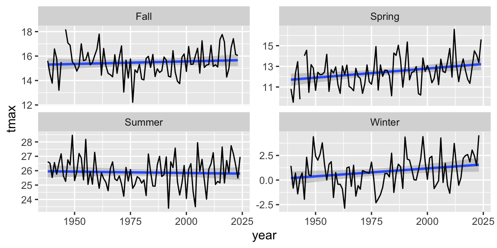


## Look for specific events: was 2020 unusually hot in Buffalo, NY?
Let's compare 2020 with all the previous years in the dataset.  First add 'day of year' to the data to facilitate showing all years on the same plot.

```r
df=d_filtered2%>%
  mutate(doy=as.numeric(format(date,"%j")),
         doydate=as.Date(paste("2020-",doy),format="%Y-%j"))
```

---

Then plot all years (in grey) and add 2020 in red.

```r
ggplot(df,aes(x=doydate,y=tmax,group=year))+
  geom_line(col="grey",alpha=.5)+ # plot each year in grey
  stat_smooth(aes(group=1),col="black")+   # Add a smooth GAM to estimate the long-term mean
  geom_line(data=filter(df,year==2020),col="red")+  # add 2017 in red
  scale_x_date(labels = date_format("%b"),date_breaks = "2 months") + 
  xlab("Day of year")
```

```
## `geom_smooth()` using method = 'gam' and formula 'y ~ s(x, bs = "cs")'
```

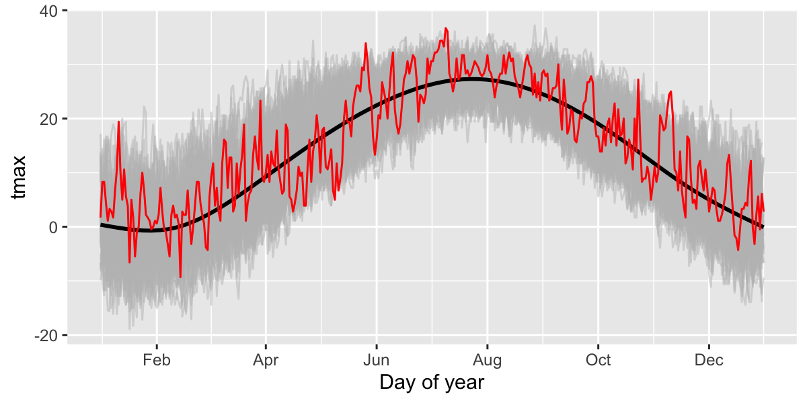

---

Then 'zoom' into just the past few months and add 2019 in red.

```r
ggplot(df,aes(x=doydate,y=tmax,group=year))+
  geom_line(col="grey",alpha=.5)+
  stat_smooth(aes(group=1),col="black")+
  geom_line(data=filter(df,year==2019),col="red")+
  scale_x_date(labels = date_format("%b"),date_breaks = "2 months",
               lim=c(as.Date("2019-08-01"),as.Date("2019-10-31")))
```

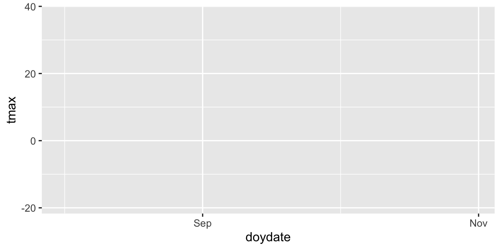


## Summarize by season

```r
seasonal=d_filtered2%>%
  group_by(year,season)%>%
  summarize(n=n(),
            tmin=mean(tmin),
            tmax=mean(tmax),
            prcp=mean(prcp))%>%
  filter(n>75)
```

```
## `summarise()` has grouped output by 'year'. You can override using the `.groups` argument.
```

## Seasonal Trends


```r
ggplot(seasonal,aes(y=tmin,x=year))+
  facet_wrap(~season,scales = "free_y")+
  stat_smooth(method="lm", se=T)+
  geom_line()
```

```
## `geom_smooth()` using formula 'y ~ x'
```

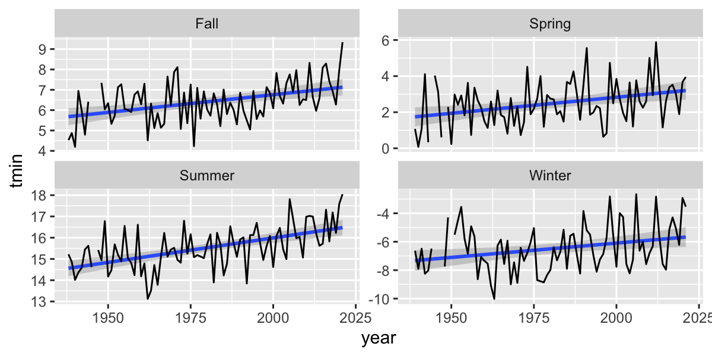

## Fit a linear model to a single season


```r
lm1=seasonal%>%
  filter(season=="Summer")%>%
  lm(tmin~year,data=.)

summary(lm1)$r.squared
```

```
## [1] 0.2820857
```

```r
tidy(lm1)%>%kable() 
```


|term        |    estimate| std.error| statistic|   p.value|
|:-----------|-----------:|---------:|---------:|---------:|
|(Intercept) | -27.3354783| 7.6402074| -3.577845| 0.0005919|
|year        |   0.0216391| 0.0038596|  5.606596| 0.0000003|

## Linear regression for _each_ season

```r
# fit a lm model for each group
  d_filtered2 %>%
  group_by(season) %>% #process by season
  nest() %>% # cut into groups
  mutate(
    lm_tmin = purrr::map(data, .f = ~ lm(tmin ~ year, data = .)), #fit model for each group
    tmin_tidy = purrr::map(lm_tmin, broom::tidy) #summarize model for each group
  ) %>%
  unnest(tmin_tidy) %>%
  filter(term == "year") %>% 
  dplyr::select(-data, -lm_tmin) %>% 
  kable()
```


|season |term |  estimate| std.error| statistic| p.value|
|:------|:----|---------:|---------:|---------:|-------:|
|Spring |year | 0.0157025| 0.0032314|  4.859407| 1.2e-06|
|Summer |year | 0.0233772| 0.0017552| 13.318941| 0.0e+00|
|Fall   |year | 0.0141380| 0.0030396|  4.651252| 3.4e-06|
|Winter |year | 0.0179402| 0.0029273|  6.128633| 0.0e+00|

## Autoregressive models
See [Time Series Analysis Task View](https://cran.r-project.org/web/views/TimeSeries.html) for summary of available pack,-ages/models. 

* Moving average (MA) models
* autoregressive (AR) models
* autoregressive moving average (ARMA) models
* frequency analysis
* Many, many more...

---

# Climate Metrics

## Climate Metrics: ClimdEX
Indices representing extreme aspects of climate derived from daily data:

Climate Change Research Centre (CCRC) at University of New South Wales (UNSW) ([climdex.org](http://www.climdex.org)).  

## 27 Core indices

For example:

* **FD** Number of frost days: Annual count of days when TN (daily minimum temperature) < 0C.
* **SU** Number of summer days: Annual count of days when TX (daily maximum temperature) > 25C.
* **ID** Number of icing days: Annual count of days when TX (daily maximum temperature) < 0C.
* **TR** Number of tropical nights: Annual count of days when TN (daily minimum temperature) > 20C.
* **GSL** Growing season length: Annual (1st Jan to 31st Dec in Northern Hemisphere (NH), 1st July to 30th June in Southern Hemisphere (SH)) count between first span of at least 6 days with daily mean temperature TG>5C and first span after July 1st (Jan 1st in SH) of 6 days with TG<5C.
* **TXx** Monthly maximum value of daily maximum temperature
* **TN10p** Percentage of days when TN < 10th percentile
* **Rx5day** Monthly maximum consecutive 5-day precipitation
* **SDII** Simple pricipitation intensity index


## Climdex indices
[ClimDex](http://www.climdex.org/indices.html)

##  Format data for `climdex`


```r
library(PCICt)
## Parse the dates into PCICt.
pc.dates <- as.PCICt(as.POSIXct(d_filtered$date),cal="gregorian")
```


## Generate the climdex object

```r
  library(climdex.pcic)
    ci <- climdexInput.raw(
      tmax=d_filtered$tmax,
      tmin=d_filtered$tmin,
      prec=d_filtered$prcp,
      pc.dates,pc.dates,pc.dates, 
      base.range=c(1971, 2000))
years=as.numeric(as.character(unique(ci@date.factors$annual)))
```

## Cumulative dry days


```r
cdd= climdex.cdd(ci, spells.can.span.years = TRUE)
plot(cdd~years,type="l")
```


## Diurnal Temperature Range


```r
dtr=climdex.dtr(ci, freq = c("annual"))
plot(dtr~years,type="l")
```


## Frost Days


```r
fd=climdex.fd(ci)
plot(fd~years,type="l")
```

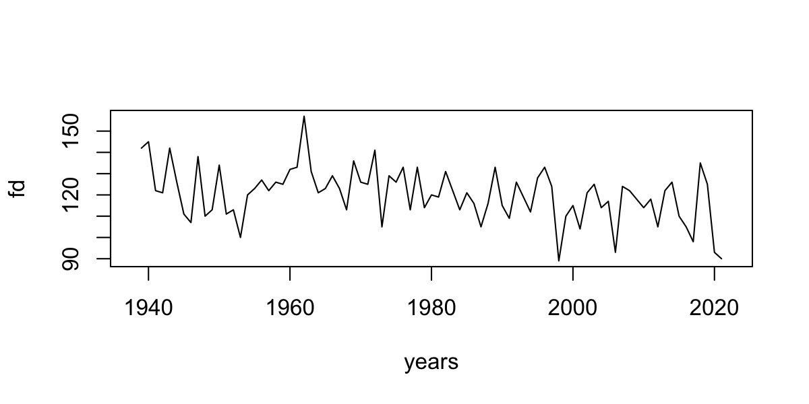
