## Course Schedule

<iframe
  src="https://geo511.wilsonlab.io/Schedule.html"
  width="100%" height="800">
</iframe>
[source](https://geo511.wilsonlab.io/Schedule.html)


## Resource Presentations


## Case Study Presentations -  Let's pick a winner!

<iframe src="https://wheelofnames.com/asw-7nk" width="100%" height="500"> </iframe>


## Next Week's Case Study

<iframe
  src="http://geo511.wilsonlab.io/CS_10.html"
  width="100%" height="800">
</iframe>
[source](http://geo511.wilsonlab.io/CS_10.html)


## Objectives

* Brief introduction to remote sensing
* Obtaining NASA remote sensing data
* MODIS
* MODIS data processing


## Active Earth Observing Satellites (EOS) (as of 5/1/2023)

* Total number of operating satellites: 7,560
    * United States: 5,184
    * China: 628
    * Russia: 181

From the [Union of Concerned Scientists Satellite Database](http://www.ucsusa.org/nuclear-weapons/space-weapons/satellite-database.html) and [Pixalytics Blog](http://www.pixalytics.com/blog/)

## Debris & Satellites in low Earth orbit


Image courtesy of [European Space Agency](http://www.esa.int/spaceinimages/Images/2008/03/Debris_objects_-_mostly_debris_-_in_low_Earth_orbit_LEO_-_view_over_the_equator)


## NASA's Earth Observing System


## Electromagnetic Radiation
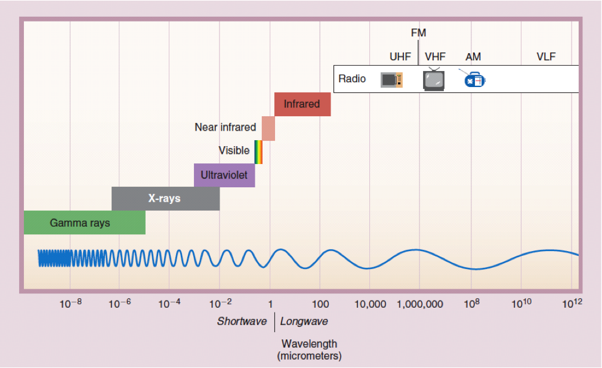

## EarthData

[EarthData.nasa.gov](https://earthdata.nasa.gov)

Datasets, news, articles, information

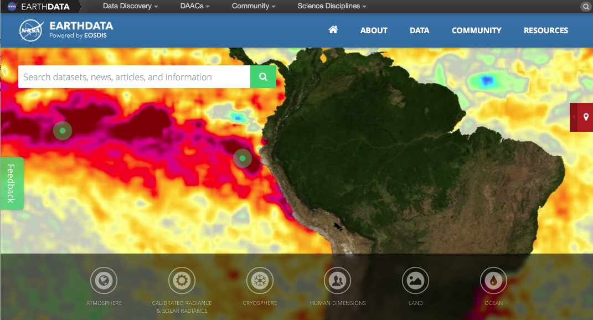

## EarthData

[EarthData.nasa.gov](https://earthdata.nasa.gov)

Datasets, news, articles, information

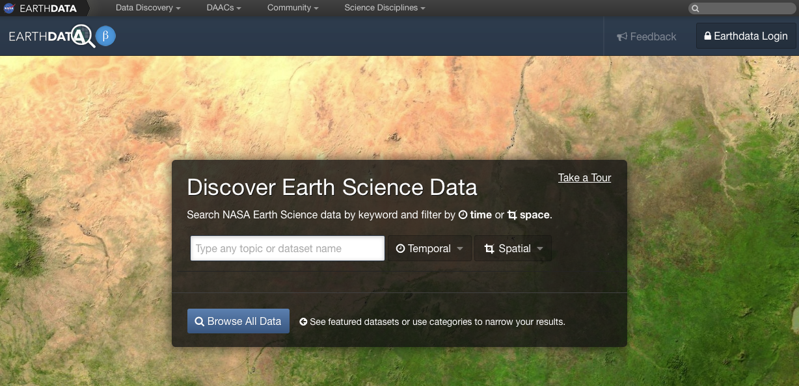

# Image Processing in R

## Terra Package

``` r
library(terra)
# Blue
b2 <- rast('data/rs/LC08_044034_20170614_B2.tif')
# Green
b3 <- rast('data/rs/LC08_044034_20170614_B3.tif')
# Red
b4 <- rast('data/rs/LC08_044034_20170614_B4.tif')
# Near Infrared (NIR)
b5 <- rast('data/rs/LC08_044034_20170614_B5.tif')
b2
```

```
## class       : SpatRaster 
## dimensions  : 1245, 1497, 1  (nrow, ncol, nlyr)
## resolution  : 30, 30  (x, y)
## extent      : 594090, 639000, 4190190, 4227540  (xmin, xmax, ymin, ymax)
## coord. ref. : WGS 84 / UTM zone 10N (EPSG:32610) 
## source      : LC08_044034_20170614_B2.tif 
## name        : LC08_044034_20170614_B2 
## min value   :               0.0748399 
## max value   :               0.7177562
```

## Metadata


``` r
# coordinate reference system (CRS)
crs(b2)
```

```
## [1] "PROJCRS[\"WGS 84 / UTM zone 10N\",\n    BASEGEOGCRS[\"WGS 84\",\n        DATUM[\"World Geodetic System 1984\",\n            ELLIPSOID[\"WGS 84\",6378137,298.257223563,\n                LENGTHUNIT[\"metre\",1]]],\n        PRIMEM[\"Greenwich\",0,\n            ANGLEUNIT[\"degree\",0.0174532925199433]],\n        ID[\"EPSG\",4326]],\n    CONVERSION[\"UTM zone 10N\",\n        METHOD[\"Transverse Mercator\",\n            ID[\"EPSG\",9807]],\n        PARAMETER[\"Latitude of natural origin\",0,\n            ANGLEUNIT[\"degree\",0.0174532925199433],\n            ID[\"EPSG\",8801]],\n        PARAMETER[\"Longitude of natural origin\",-123,\n            ANGLEUNIT[\"degree\",0.0174532925199433],\n            ID[\"EPSG\",8802]],\n        PARAMETER[\"Scale factor at natural origin\",0.9996,\n            SCALEUNIT[\"unity\",1],\n            ID[\"EPSG\",8805]],\n        PARAMETER[\"False easting\",500000,\n            LENGTHUNIT[\"metre\",1],\n            ID[\"EPSG\",8806]],\n        PARAMETER[\"False northing\",0,\n            LENGTHUNIT[\"metre\",1],\n            ID[\"EPSG\",8807]]],\n    CS[Cartesian,2],\n        AXIS[\"(E)\",east,\n            ORDER[1],\n            LENGTHUNIT[\"metre\",1]],\n        AXIS[\"(N)\",north,\n            ORDER[2],\n            LENGTHUNIT[\"metre\",1]],\n    USAGE[\n        SCOPE[\"Engineering survey, topographic mapping.\"],\n        AREA[\"Between 126°W and 120°W, northern hemisphere between equator and 84°N, onshore and offshore. Canada - British Columbia (BC); Northwest Territories (NWT); Nunavut; Yukon. United States (USA) - Alaska (AK).\"],\n        BBOX[0,-126,84,-120]],\n    ID[\"EPSG\",32610]]"
```

``` r
# Number of cells, rows, columns
ncell(b2)
```

```
## [1] 1863765
```

``` r
dim(b2)
```

```
## [1] 1245 1497    1
```

``` r
# spatial resolution
res(b2)
```

```
## [1] 30 30
```

``` r
# Number of bands
nlyr(b2)
```

```
## [1] 1
```

``` r
# Do the bands have the same extent, number of rows and columns, projection, resolution, and origin 
compareGeom(b2,b3)
```

```
## [1] TRUE
```

## Check the properties of the SpatRast

``` r
s <- c(b5, b4, b3)
s
```

```
## class       : SpatRaster 
## dimensions  : 1245, 1497, 3  (nrow, ncol, nlyr)
## resolution  : 30, 30  (x, y)
## extent      : 594090, 639000, 4190190, 4227540  (xmin, xmax, ymin, ymax)
## coord. ref. : WGS 84 / UTM zone 10N (EPSG:32610) 
## sources     : LC08_044034_20170614_B5.tif  
##               LC08_044034_20170614_B4.tif  
##               LC08_044034_20170614_B3.tif  
## names       : LC08_04403~0170614_B5, LC08_04403~0170614_B4, LC08_04403~0170614_B3 
## min values  :          0.0008457669,            0.02084067,            0.04259216 
## max values  :          1.0124315023,            0.78617686,            0.69246972
```

## Import multiple bands

``` r
filenames <- paste0('data/rs/LC08_044034_20170614_B', 1:11, ".tif")
filenames
```

```
##  [1] "data/rs/LC08_044034_20170614_B1.tif" 
##  [2] "data/rs/LC08_044034_20170614_B2.tif" 
##  [3] "data/rs/LC08_044034_20170614_B3.tif" 
##  [4] "data/rs/LC08_044034_20170614_B4.tif" 
##  [5] "data/rs/LC08_044034_20170614_B5.tif" 
##  [6] "data/rs/LC08_044034_20170614_B6.tif" 
##  [7] "data/rs/LC08_044034_20170614_B7.tif" 
##  [8] "data/rs/LC08_044034_20170614_B8.tif" 
##  [9] "data/rs/LC08_044034_20170614_B9.tif" 
## [10] "data/rs/LC08_044034_20170614_B10.tif"
## [11] "data/rs/LC08_044034_20170614_B11.tif"
```

``` r
landsat <- rast(filenames)
landsat
```

```
## class       : SpatRaster 
## dimensions  : 1245, 1497, 11  (nrow, ncol, nlyr)
## resolution  : 30, 30  (x, y)
## extent      : 594090, 639000, 4190190, 4227540  (xmin, xmax, ymin, ymax)
## coord. ref. : WGS 84 / UTM zone 10N (EPSG:32610) 
## sources     : LC08_044034_20170614_B1.tif  
##               LC08_044034_20170614_B2.tif  
##               LC08_044034_20170614_B3.tif  
##               ... and 8 more source(s)
## names       : LC08_~14_B1, LC08_~14_B2, LC08_~14_B3, LC08_~14_B4,  LC08_~14_B5,  LC08_~14_B6, ... 
## min values  :  0.09641791,   0.0748399,  0.04259216,  0.02084067, 0.0008457669, -0.007872183, ... 
## max values  :  0.73462820,   0.7177562,  0.69246972,  0.78617686, 1.0124315023,  1.043204546, ...
```

## Blue, Green, Red, NIR

``` r
par(mfrow = c(1,2))
plot(b4, main = "Red", col = gray(0:100 / 100))
plot(b5, main = "NIR", col = gray(0:100 / 100))
```

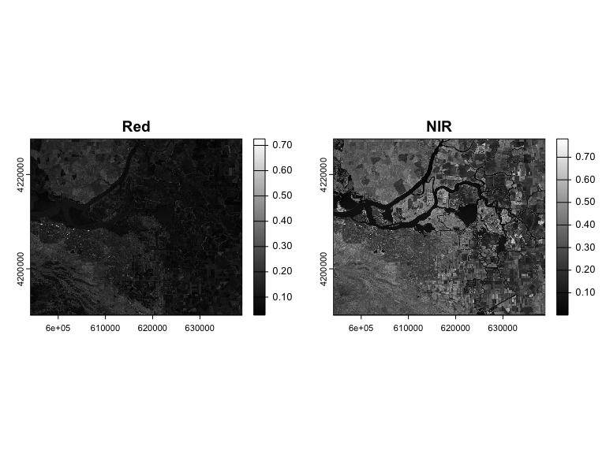<!-- -->


## Plotting

``` r
landsatRGB <- c(b4, b3, b2)

par(mfrow = c(1,2))
plotRGB(landsatRGB, axes=TRUE, stretch="lin", main="Landsat True Color")

landsatFCC <- c(b5, b4, b3)
plotRGB(landsatFCC, axes=TRUE, stretch="lin", main="Landsat False Color")
```

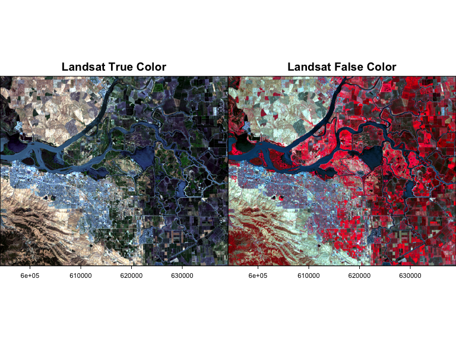<!-- -->

## Vegetation indices


``` r
fndvi <- function(x, y) { # NDVI
    (x - y) / (x + y)
}
ndvi <- lapp(landsat[[c(5,4)]], fun=fndvi) # NIR, Red
plot(ndvi, col=rev(terrain.colors(10)), main="Landsat-NDVI")
```

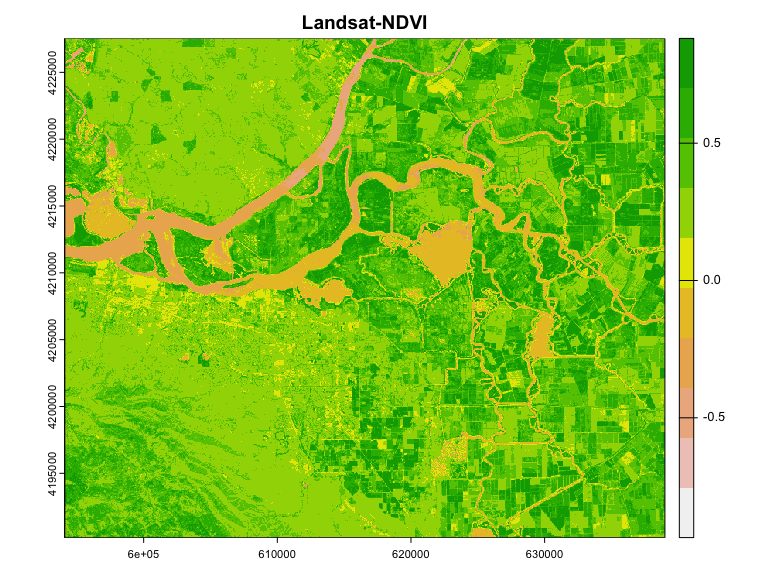<!-- -->

## More resources

* [_Spatial Data Science_ chapter on Remote Sensing Image Analysis](https://rspatial.org/raster/rs/index.html)
* R Packages:
   * [rLandsat](https://github.com/atlanhq/rLandsat)
   
   * [MODIStsp](https://ropensci.github.io/MODIStsp/): automatizing the creation of time series of raster images derived from MODIS Land Products data.
   * [RStoolbox](http://bleutner.github.io/RStoolbox/): RS data processing
   * [hsdar](https://cran.r-project.org/package=hsdar): Hyperspectral data
   * [rasterVis](https://oscarperpinan.github.io/rastervis/): Visualization 

# MODIS

## Moderate Resolution Imaging Spectroradiometer (MODIS)


2 Satellites _Terra_ launched in 1999, _Aqua_ in 2002.


## Technical Details: swath

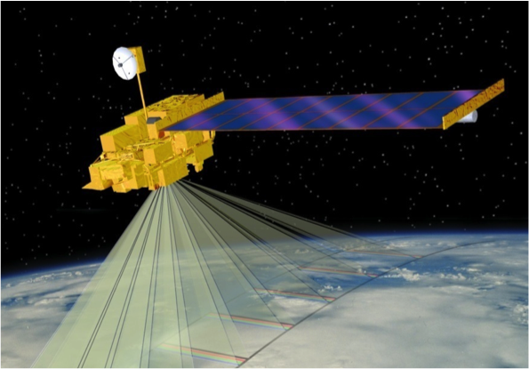

Viewing swath width of 2,330 km

Technical Details: spatial coverage

---

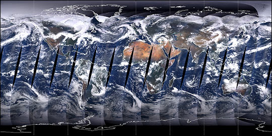

Covers Earth every one to two days

Technical Details: spectral coverage

---


36 spectral bands between 0.405 and 14.385 µm

Technical Details: spatial resolution

---

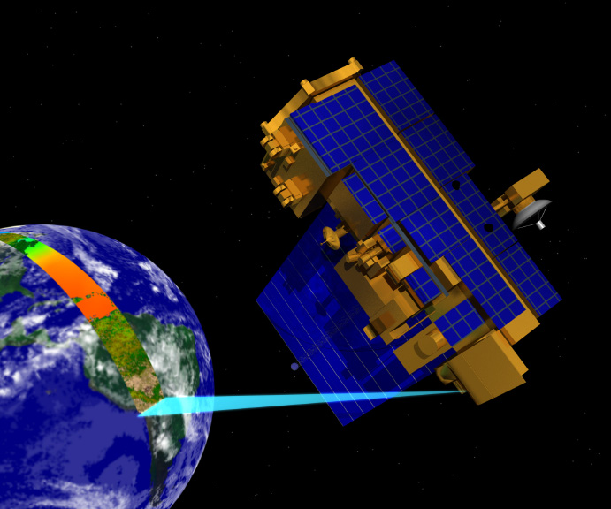

3 spatial resolutions -- 250m, 500m, and 1,000m 

## MODIS Data Processing

* Tracking and Data Relay Satellite System in White Sands, New Mexico
* EOS Data and Operations System @ Goddard Space Flight Center in Greenbelt, MD
* MODIS Adaptive Processing System (MODAPS)
* 3 DAACs for distribution

## MODIS products (a subset...)

### Atmosphere

* Aerosol & Clouds
* Total Precipitable Water

### Cryosphere Products

* Snow Cover
* Sea Ice and Ice Surface Temperature

### Ocean Products

* Sea Surface Temperature
* Sub-surface Chlorophyll-a Concentration
* Particulate Carbon
* Photosynthetically Available Radiation

---

### Land Products

* Surface Reflectance
* Land Surface Temperature and Emissivity
* Land Cover Products
* Vegetation Index Products (NDVI and EVI)
* Thermal Anomalies - Active Fires
* Photosynthetically Active Radiation (FPAR) / Leaf Area Index (LAI)
* Evapotranspiration
* Primary Productivity
* Vegetation Continuous Fields
* Water Mask
* Burned Area Product

## Example product workflow

 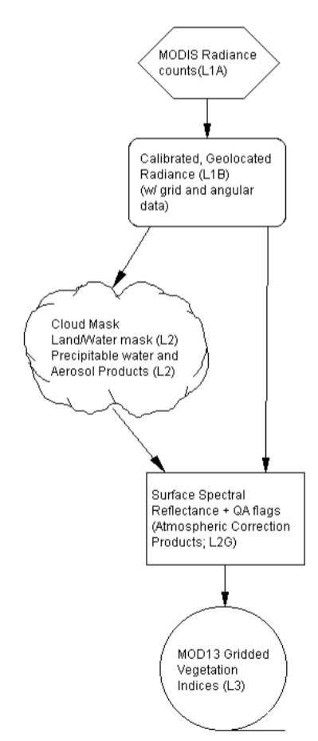

 
MODIS Products used to generate vegetation indices. From the [MOD13 Algorithm Theoretical Basis Document](http://modis.gsfc.nasa.gov/data/atbd/atbd_mod13.pdf).  

# Data

## Data formats

Most NASA EOS data distributed as HDF files, which are very similar to netCDF.


## NetCDF / HDF


## Reading EO Data

`terra` package functions can read NetCDF/HDF files if `ncdf4` package is installed.

``` r
ncfile="data/MOD11A2.006_aid0001.nc"
nc=ncdf4::nc_open(ncfile,verbose = F)
str(nc$var)
```

```
## List of 3
##  $ crs        :List of 20
##   ..$ id                :List of 5
##   .. ..$ id         : num 0
##   .. ..$ group_index: num -1
##   .. ..$ group_id   : int 65536
##   .. ..$ list_index : num 1
##   .. ..$ isdimvar   : logi FALSE
##   .. ..- attr(*, "class")= chr "ncid4"
##   ..$ name              : chr "crs"
##   ..$ ndims             : int 0
##   ..$ natts             : int 10
##   ..$ size              : num 1
##   ..$ dimids            : int NA
##   ..$ prec              : chr "byte"
##   ..$ units             : chr ""
##   ..$ longname          : chr "crs"
##   ..$ group_index       : int 1
##   ..$ chunksizes        : int NA
##   ..$ storage           : int 1
##   ..$ shuffle           : int 0
##   ..$ compression       : logi NA
##   ..$ dims              : list()
##   ..$ unlim             : logi FALSE
##   ..$ make_missing_value: logi FALSE
##   ..$ missval           : logi NA
##   ..$ hasAddOffset      : logi FALSE
##   ..$ hasScaleFact      : logi FALSE
##   ..- attr(*, "class")= chr "ncvar4"
##  $ LST_Day_1km:List of 24
##   ..$ id                :List of 5
##   .. ..$ id         : num 4
##   .. ..$ group_index: num -1
##   .. ..$ group_id   : int 65536
##   .. ..$ list_index : num 2
##   .. ..$ isdimvar   : logi FALSE
##   .. ..- attr(*, "class")= chr "ncid4"
##   ..$ name              : chr "LST_Day_1km"
##   ..$ ndims             : int 3
##   ..$ natts             : int 14
##   ..$ size              : int [1:3] 42 47 811
##   ..$ dimids            : int [1:3] 2 1 0
##   ..$ prec              : chr "int"
##   ..$ units             : chr "K"
##   ..$ longname          : chr "8-day daytime 1km grid Land-surface Temperature"
##   ..$ group_index       : int 1
##   ..$ chunksizes        : int [1:3] 21 24 406
##   ..$ storage           : int 2
##   ..$ shuffle           : int 1
##   ..$ compression       : int 4
##   ..$ dims              : list()
##   ..$ dim               :List of 3
##   .. ..$ :List of 10
##   .. .. ..$ name         : chr "xdim"
##   .. .. ..$ len          : int 42
##   .. .. ..$ unlim        : logi FALSE
##   .. .. ..$ group_index  : int 1
##   .. .. ..$ group_id     : int 65536
##   .. .. ..$ id           : int 2
##   .. .. ..$ dimvarid     :List of 5
##   .. .. .. ..$ id         : int 3
##   .. .. .. ..$ group_index: int 1
##   .. .. .. ..$ group_id   : int 65536
##   .. .. .. ..$ list_index : num -1
##   .. .. .. ..$ isdimvar   : logi TRUE
##   .. .. .. ..- attr(*, "class")= chr "ncid4"
##   .. .. ..$ units        : chr "m"
##   .. .. ..$ vals         : num [1:42(1d)] 1373722 1374649 1375575 1376502 1377429 ...
##   .. .. ..$ create_dimvar: logi TRUE
##   .. .. ..- attr(*, "class")= chr "ncdim4"
##   .. ..$ :List of 10
##   .. .. ..$ name         : chr "ydim"
##   .. .. ..$ len          : int 47
##   .. .. ..$ unlim        : logi FALSE
##   .. .. ..$ group_index  : int 1
##   .. .. ..$ group_id     : int 65536
##   .. .. ..$ id           : int 1
##   .. .. ..$ dimvarid     :List of 5
##   .. .. .. ..$ id         : int 2
##   .. .. .. ..$ group_index: int 1
##   .. .. .. ..$ group_id   : int 65536
##   .. .. .. ..$ list_index : num -1
##   .. .. .. ..$ isdimvar   : logi TRUE
##   .. .. .. ..- attr(*, "class")= chr "ncid4"
##   .. .. ..$ units        : chr "m"
##   .. .. ..$ vals         : num [1:47(1d)] 2362432 2361505 2360578 2359652 2358725 ...
##   .. .. ..$ create_dimvar: logi TRUE
##   .. .. ..- attr(*, "class")= chr "ncdim4"
##   .. ..$ :List of 11
##   .. .. ..$ name         : chr "time"
##   .. .. ..$ len          : int 811
##   .. .. ..$ unlim        : logi FALSE
##   .. .. ..$ group_index  : int 1
##   .. .. ..$ group_id     : int 65536
##   .. .. ..$ id           : int 0
##   .. .. ..$ dimvarid     :List of 5
##   .. .. .. ..$ id         : int 1
##   .. .. .. ..$ group_index: int 1
##   .. .. .. ..$ group_id   : int 65536
##   .. .. .. ..$ list_index : num -1
##   .. .. .. ..$ isdimvar   : logi TRUE
##   .. .. .. ..- attr(*, "class")= chr "ncid4"
##   .. .. ..$ units        : chr "days since 2000-01-01 00:00:00"
##   .. .. ..$ calendar     : chr "julian"
##   .. .. ..$ vals         : int [1:811(1d)] 48 56 64 72 80 88 96 104 112 120 ...
##   .. .. ..$ create_dimvar: logi TRUE
##   .. .. ..- attr(*, "class")= chr "ncdim4"
##   ..$ varsize           : int [1:3] 42 47 811
##   ..$ unlim             : logi FALSE
##   ..$ make_missing_value: logi TRUE
##   ..$ missval           : int 0
##   ..$ hasAddOffset      : logi TRUE
##   ..$ addOffset         : num 0
##   ..$ hasScaleFact      : logi TRUE
##   ..$ scaleFact         : num 0.02
##   ..- attr(*, "class")= chr "ncvar4"
##  $ QC_Day     :List of 22
##   ..$ id                :List of 5
##   .. ..$ id         : num 5
##   .. ..$ group_index: num -1
##   .. ..$ group_id   : int 65536
##   .. ..$ list_index : num 3
##   .. ..$ isdimvar   : logi FALSE
##   .. ..- attr(*, "class")= chr "ncid4"
##   ..$ name              : chr "QC_Day"
##   ..$ ndims             : int 3
##   ..$ natts             : int 7
##   ..$ size              : int [1:3] 42 47 811
##   ..$ dimids            : int [1:3] 2 1 0
##   ..$ prec              : chr "short"
##   ..$ units             : chr ""
##   ..$ longname          : chr "Quality control for daytime LST and emissivity"
##   ..$ group_index       : int 1
##   ..$ chunksizes        : int [1:3] 42 47 811
##   ..$ storage           : int 2
##   ..$ shuffle           : int 1
##   ..$ compression       : int 4
##   ..$ dims              : list()
##   ..$ dim               :List of 3
##   .. ..$ :List of 10
##   .. .. ..$ name         : chr "xdim"
##   .. .. ..$ len          : int 42
##   .. .. ..$ unlim        : logi FALSE
##   .. .. ..$ group_index  : int 1
##   .. .. ..$ group_id     : int 65536
##   .. .. ..$ id           : int 2
##   .. .. ..$ dimvarid     :List of 5
##   .. .. .. ..$ id         : int 3
##   .. .. .. ..$ group_index: int 1
##   .. .. .. ..$ group_id   : int 65536
##   .. .. .. ..$ list_index : num -1
##   .. .. .. ..$ isdimvar   : logi TRUE
##   .. .. .. ..- attr(*, "class")= chr "ncid4"
##   .. .. ..$ units        : chr "m"
##   .. .. ..$ vals         : num [1:42(1d)] 1373722 1374649 1375575 1376502 1377429 ...
##   .. .. ..$ create_dimvar: logi TRUE
##   .. .. ..- attr(*, "class")= chr "ncdim4"
##   .. ..$ :List of 10
##   .. .. ..$ name         : chr "ydim"
##   .. .. ..$ len          : int 47
##   .. .. ..$ unlim        : logi FALSE
##   .. .. ..$ group_index  : int 1
##   .. .. ..$ group_id     : int 65536
##   .. .. ..$ id           : int 1
##   .. .. ..$ dimvarid     :List of 5
##   .. .. .. ..$ id         : int 2
##   .. .. .. ..$ group_index: int 1
##   .. .. .. ..$ group_id   : int 65536
##   .. .. .. ..$ list_index : num -1
##   .. .. .. ..$ isdimvar   : logi TRUE
##   .. .. .. ..- attr(*, "class")= chr "ncid4"
##   .. .. ..$ units        : chr "m"
##   .. .. ..$ vals         : num [1:47(1d)] 2362432 2361505 2360578 2359652 2358725 ...
##   .. .. ..$ create_dimvar: logi TRUE
##   .. .. ..- attr(*, "class")= chr "ncdim4"
##   .. ..$ :List of 11
##   .. .. ..$ name         : chr "time"
##   .. .. ..$ len          : int 811
##   .. .. ..$ unlim        : logi FALSE
##   .. .. ..$ group_index  : int 1
##   .. .. ..$ group_id     : int 65536
##   .. .. ..$ id           : int 0
##   .. .. ..$ dimvarid     :List of 5
##   .. .. .. ..$ id         : int 1
##   .. .. .. ..$ group_index: int 1
##   .. .. .. ..$ group_id   : int 65536
##   .. .. .. ..$ list_index : num -1
##   .. .. .. ..$ isdimvar   : logi TRUE
##   .. .. .. ..- attr(*, "class")= chr "ncid4"
##   .. .. ..$ units        : chr "days since 2000-01-01 00:00:00"
##   .. .. ..$ calendar     : chr "julian"
##   .. .. ..$ vals         : int [1:811(1d)] 48 56 64 72 80 88 96 104 112 120 ...
##   .. .. ..$ create_dimvar: logi TRUE
##   .. .. ..- attr(*, "class")= chr "ncdim4"
##   ..$ varsize           : int [1:3] 42 47 811
##   ..$ unlim             : logi FALSE
##   ..$ make_missing_value: logi TRUE
##   ..$ missval           : int 0
##   ..$ hasAddOffset      : logi FALSE
##   ..$ hasScaleFact      : logi FALSE
##   ..- attr(*, "class")= chr "ncvar4"
```

## Read NetCDF with rast()

``` r
lst=rast(ncfile,subds="LST_Day_1km")
```

``` r
lst
```

```
## class       : SpatRaster 
## dimensions  : 47, 42, 811  (nrow, ncol, nlyr)
## resolution  : 926.6254, 926.6254  (x, y)
## extent      : 1373259, 1412177, 2319343, 2362895  (xmin, xmax, ymin, ymax)
## coord. ref. : +proj=aea +lat_0=23 +lon_0=-96 +lat_1=29.5 +lat_2=45.5 +x_0=0 +y_0=0 +datum=WGS84 +units=m +no_defs 
## source      : MOD11A2.006_aid0001.nc:LST_Day_1km 
## varname     : LST_Day_1km (8-day daytime 1km grid Land-surface Temperature) 
## names       : LST_D~1km_1, LST_D~1km_2, LST_D~1km_3, LST_D~1km_4, LST_D~1km_5, LST_D~1km_6, ... 
## unit        :           K,           K,           K,           K,           K,           K, ... 
## time (days) : 2000-02-18 to 2017-10-16
```


## Plot Raster Stack


``` r
lst[[1:10]] %>% gplot()+
    geom_raster(aes(fill=value))+
    facet_wrap(~variable,nrow=1)+
    coord_equal()+
    theme(axis.text=element_blank())
```

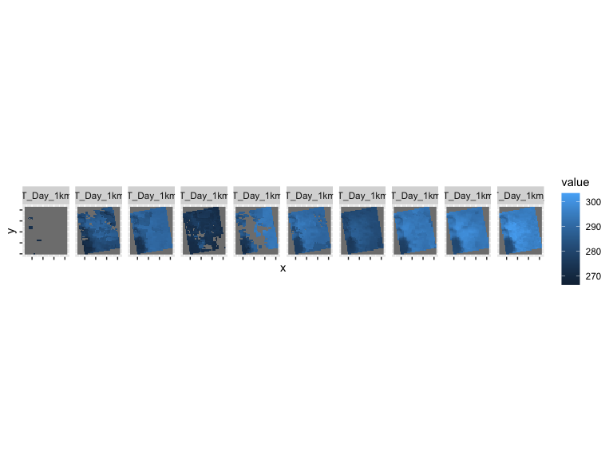<!-- -->

## Collection-Level Naming Conventsions 

`MODIS/Terra Surface Reflectance 8-Day L3 Global 500m SIN Grid V005`

* `MODIS/Terra` - Instrument/Sensor
* `Surface Reflectance` - Geophysical Parameter
* `8-Day` - Temporal Resolution
* `L3` - Processing Level
* `Global` - Global or Swath
* `500m` - Spatial Resolution
* `SIN Grid` - Gridded or Not
* `V005` - Collection Version

## MODIS Gridding system


## Filename Conventions


`MOD09A1.A2006001.h08v05.005.2006012234657.hdf`

* `MOD09A1` - Product Short Name
* `.A2006001` - Julian Date of Acquisition (A-YYYYDDD)
* `.h08v05` - Tile Identifier (horizontalXXverticalYY)
* `.005` - Collection Version
* `.2006012234567` - Julian Date of Production (YYYYDDDHHMMSS)
* `.hdf` - Data Format (HDF-EOS)

## MODIS Temporal Resolution


* Daily
* 8-Day
* 16-Day
* Monthly
* Quarterly
* Yearly

## MODIS Spatial Resolution


* **Bands 1–2**  250-meter
* **Bands 3–7**  500-meter
* **Bands 8–36**  1000-meter

## MODIS Data

### Distributed Active Archive Centers (DAACs)

* **Level 1 data:** geolocation, cloud mask, and atmosphere products [ladsweb.nascom.nasa.gov](http://ladsweb.nascom.nasa.gov/)
* **Land products:** [lpdaac.usgs.gov](https://lpdaac.usgs.gov/)
* **Cryosphere (snow/ice) products:** [nsidc.org/daac/modis](http://nsidc.org/daac/modis/index.html)
* **Ocean color and sea surface temperature:** [oceancolor.gsfc.nasa.gov](http://oceancolor.gsfc.nasa.gov/)


## Accessing data


The Land Processes Distributed Active Archive Center has a nice "Data Discovery" Tool:


## MODIS Products Table

Lists [all available MODIS land products]()

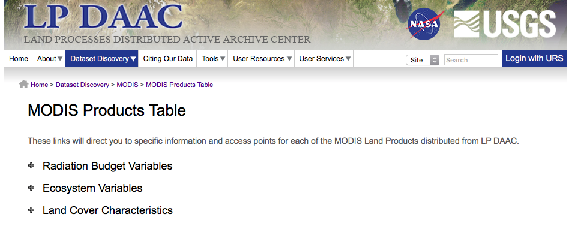

## Annual Land Cover Type Description

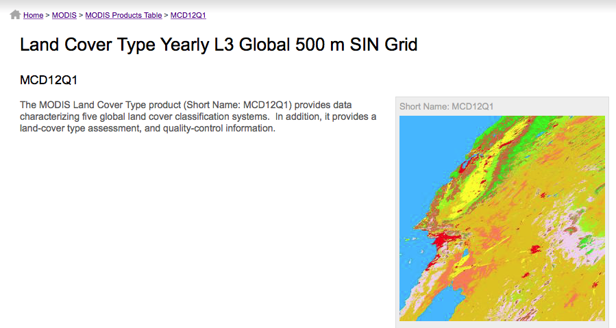


## Detailed layer information

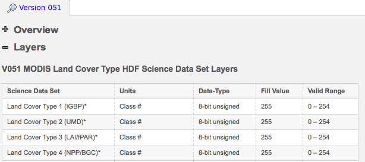


## Data access links


Downloading: `http`/`ftp` access

---

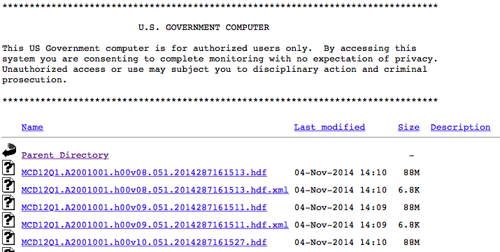

or the [LP DAAC2Disk Download Manager](https://lpdaac.usgs.gov/sites/default/files/public/datapool/DAAC2DiskUserGuide.pdf) which builds a download script.

## MODIS Reprojection Tool

Available at [lpdaac.usgs.gov/tools/modis_reprojection_tool](https://lpdaac.usgs.gov/tools/modis_reprojection_tool).

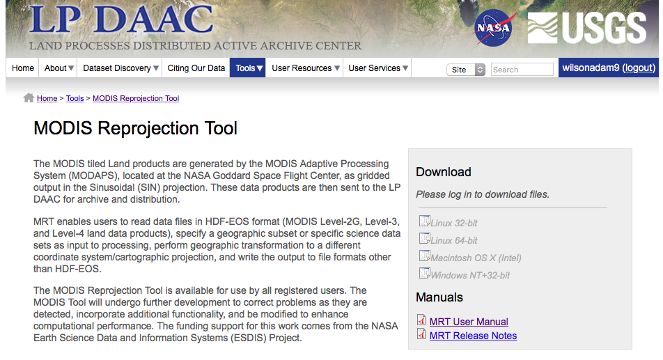

## MODIS Reprojection Tool:  Subset & Reproject


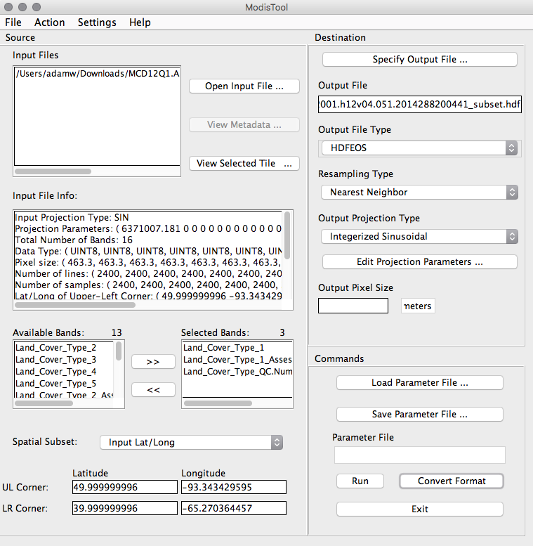

`MCD12Q1.A2012001.h12v04.051.2014288200441.hdf`

## Application for Extracting and Exploring Analysis Ready Samples (AppEEARS)

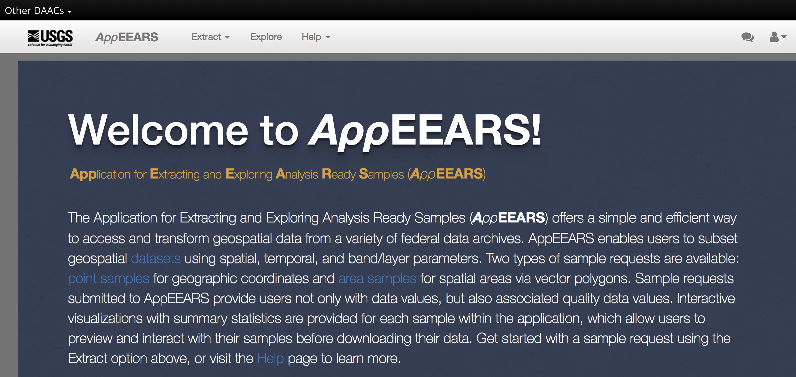

[https://lpdaacsvc.cr.usgs.gov/appeears/](https://lpdaacsvc.cr.usgs.gov/appeears/)

* Provide access to regional subsets
* Merge across tiles
* Download full time series

## Data Subset

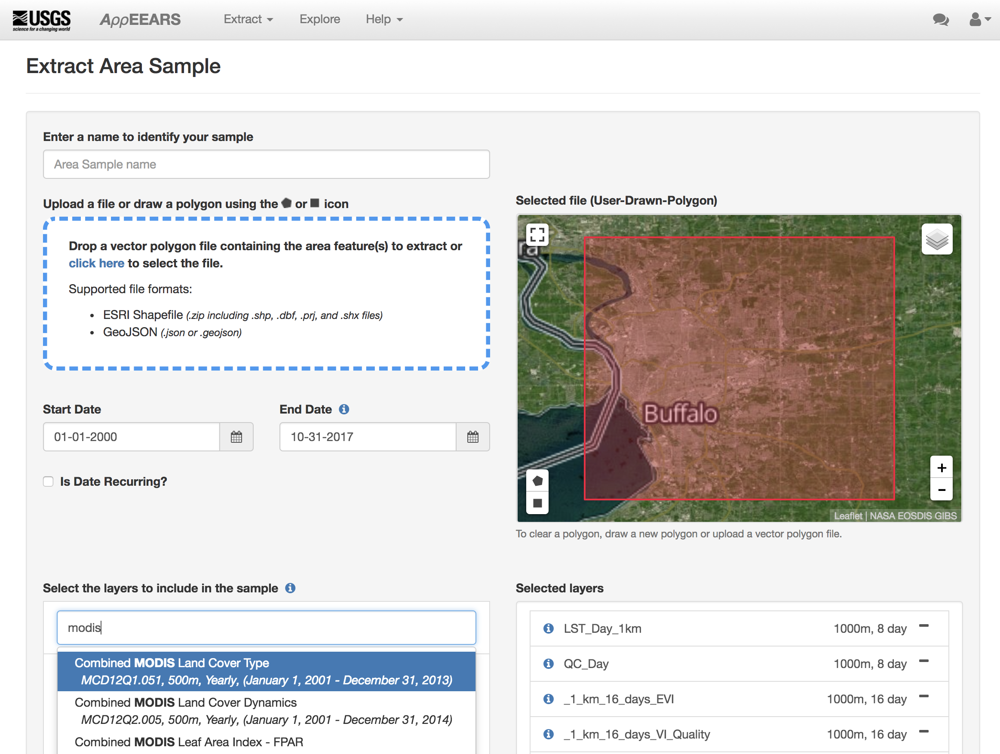

Submit and wait for results...

## Case Study

Analysis of Land Use Land Cover and Land Surface Temperature across Buffalo using MODIS timeseries.


## Presentation Credits

* Images: NASA
* Some contents from Steve Ackerman `stevea@ssec.wisc.edu`, Cooperative Institute for Meteorological Satellite Studies, University of Wisconsin-Madison
