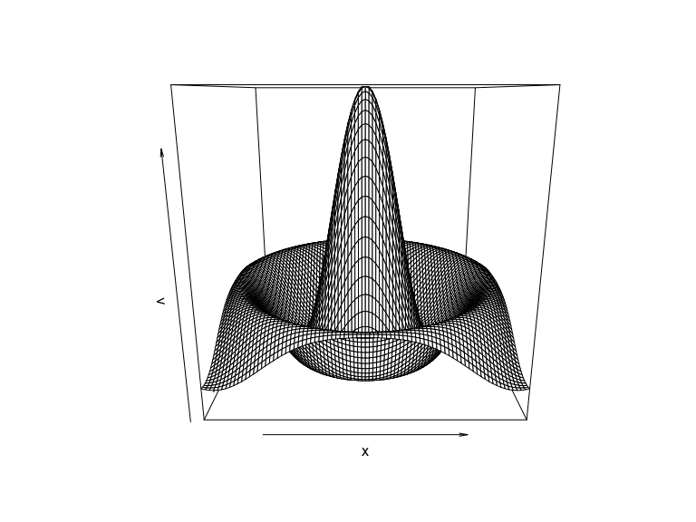

## Course Schedule

<iframe
  src="https://geo511.wilsonlab.io/Schedule.html"
  width="100%" height="800">
</iframe>
[source](https://geo511.wilsonlab.io/Schedule.html)


## Resource Presentations


## Case Study Presentations -  Let's pick a winner!

<iframe src="https://wheelofnames.com/asw-7nk" width="100%" height="500"> </iframe>


## Next Week's Case Study

<iframe
  src="http://geo511.wilsonlab.io/CS_11.html"
  width="100%" height="800">
</iframe>
[source](http://geo511.wilsonlab.io/CS_11.html)

# Introduction to Parallel Processing

## Serial Computing
Most (legacy) software is written for serial computation:

  * Problem broken into discrete set of instructions
  * Instructions executed sequentially on a single processor
  

<br><span style="color:grey; font-size:0.5em;">Figure from [here](https://computing.llnl.gov/tutorials/parallel_comp/) </span>

## Parallel computation

  * Problem divided into discrete parts that can be solved concurrently
  * Instructions executed simultaneously on different processors
  * Overall control/coordination mechanism


<br><span style="color:grey; font-size:0.5em;">Figure from [here](https://computing.llnl.gov/tutorials/parallel_comp/) </span>


## Flynn's taxonomy
A classification of computer architectures ([Flynn, 1972](http://dx.doi.org/10.1109/TC.1972.5009071))

### Four Categories

1.  *Single Instruction, Single Data (SISD)*
    * No parallelization
2.  *Single Instruction, Multiple Data (SIMD)*
    * Run the same code/analysis on different datasets
    * Examples: 
         * different species in species distribution model
         * same species under different climates

---

3. *Multiple Instruction, Single Data (MISD)*
    * Run different code/analyses on the same data
    * Examples:
        * One species, multiple models
4. *Multiple Instruction, Multiple Data streams (MIMD)*
    * Run different code/analyses on different data
    * Examples:
         * Different species & different models

## Flynn's Taxonomy

<br><span style="color:grey; font-size:0.5em;">Figure from [here](http://en.wikipedia.org/wiki/Flynn%27s_taxonomy)</span>

## Our focus: *Single Instruction, Multiple Data (SIMD)*
1. Parallel functions within an R script
    * starts on single processor
    * runs looped elements on multiple 'slave' processors
    * returns results of all iterations to the original instance
    * foreach, multicore, plyr, raster
2. Alternative: run many separate instances of R in parallel with `Rscript`
    * need another operation to combine the results
    * preferable for long, complex jobs
    * NOT planning to discuss in this session

## R Packages
There are many R packages for parallelization, check out the CRAN Task View on [High-Performance and Parallel Computing](http://cran.r-project.org/web/views/HighPerformanceComputing.html) for an overview.  For example: 

* [Rmpi](http://cran.r-project.org/web/packages/Rmpi/index.html): Built on MPI (Message Passing Interface), a de facto standard in parallel computing.
* [snow](http://cran.r-project.org/web/packages/snow/index.html):  Simple Network of Workstations can use several standards (PVM, MPI, NWS)
* [parallel](https://stat.ethz.ch/R-manual/R-devel/library/parallel/doc/parallel.pdf) Built in R package (since v2.14.0).
* [multidplyr](https://github.com/hadley/multidplyr/blob/master/vignettes/multidplyr.md)


## `ForEach` Package
The foreach package has numerous advantages including:

  * intuitive `for()` loop-like syntax
  * flexibility of parallel 'backends' from laptops to supercomputers (`multicore`, `parallel`, `snow`, `Rmpi`, etc.)
  * nice options for combining output from parallelized jobs

## Documentation for foreach:
 - [foreach manual](http://cran.r-project.org/web/packages/foreach/foreach.pdf)
 - [foreach vignette](http://cran.r-project.org/web/packages/foreach/vignettes/foreach.pdf)
 - [Nested Loops](http://cran.r-project.org/web/packages/foreach/vignettes/nested.pdf)


### Foreach _backends_
 - [doParallel](http://cran.r-project.org/web/packages/doParallel/index.html) best for use on multicore machines (uses `fork` on linux/mac and `snow` on windows).
 - [doMPI](http://cran.r-project.org/web/packages/doMPI/vignettes/doMPI.pdf): Interface to MPI (Message-Passing Interface)
 - [doSNOW](http://cran.r-project.org/web/packages/doSNOW/doSNOW.pdf): Simple Network of Workstations

# Examples

## Libraries

``` r
## New Packages
library(foreach)
library(doParallel)
library(tidyverse)
```

## _Sequential_ `for` loops

### With `for()`


``` r
x=vector()
for(i in 1:3) 
  x[i]=i^2
x
```


## _Sequential_ `for` loops


``` r
x=vector()
for(i in 1:3) 
  x[i]=i^2
x
```

```
## [1] 1 4 9
```


## With `foreach()`

``` r
x <- foreach(i=1:3) %do% 
  i^2
x
```

```
## [[1]]
## [1] 1
## 
## [[2]]
## [1] 4
## 
## [[3]]
## [1] 9
```

`x` is a list with one element for each iterator variable (`i`).  You can also specify a function to use to combine the outputs with `.combine`.  Let's concatenate the results into a vector with `c`.

## _Sequential_ `foreach()` loop with `.combine`

``` r
x <- foreach(i=1:3,.combine='c') %do% 
  i^2
x
```

```
## [1] 1 4 9
```

Tells `foreach()` to first calculate each iteration, then `.combine` them with a `c(...)`

## _Sequential_ `foreach()` loop with `.combine`

``` r
x <- foreach(i=1:3,.combine='rbind') %do% 
  i^2
x
```

```
##          [,1]
## result.1    1
## result.2    4
## result.3    9
```


## Another example

``` r
x <- seq(-8, 8, by=0.2)
v <- foreach(y=x, .combine="cbind") %do% {
    r <- sqrt(x^2 + y^2)
    sin(r) / r 
}
persp(x, x, v)
```

<!-- -->


## _Parallel_ `foreach()` loop

So far we've used `%do%` which uses a single processor.

Must register a _parallel backend_ with one of the `do*` functions. On most multicore systems, the easiest backend is typically `doParallel()`. On linux and mac, it uses `fork` system call and on Windows machines it uses `snow` backend. The nice thing is it chooses automatically for the system.


``` r
registerDoParallel(3) # register specified number of workers
#registerDoParallel() # or, reserve all all available cores 
getDoParWorkers() # check registered cores
```

```
## [1] 3
```

## _Parallel_ `foreach()` loop
To run in parallel, simply change the `%do%` to `%dopar%`.  Wasn't that easy?


``` r
## run the loop
x <- foreach(i=1:3, .combine='c') %dopar% 
  i^2
x
```

```
## [1] 1 4 9
```

## Test the relative speed


``` r
library(tictoc)
## Sequential
tic()
x <- foreach(i=1:3, .combine='c') %do% 
  i^2
toc()
```

```
## 0.002 sec elapsed
```

``` r
## Parallel
tic()
x <- foreach(i=1:3, .combine='c') %dopar% 
  i^2
toc()
```

```
## 0.011 sec elapsed
```

## Test the relative speed


``` r
# Sequential
tic()
x <- foreach(i=1:3, .combine='c') %do% 
  Sys.sleep(3)
toc()
```

```
## 9.019 sec elapsed
```

``` r
## Parallel
tic()
x <- foreach(i=1:3, .combine='c') %dopar% 
  Sys.sleep(3)
toc()
```

```
## 3.018 sec elapsed
```

## Another example


``` r
# Example task: Simulate a large number of random normal distributions and calculate their means
num_simulations <- 1000
sample_size <- 1e6  # Size of each random sample

# sequential foreach loop
tic()
results <- foreach(i = 1:num_simulations, .combine = 'c') %do% {
  # Generate a random sample and calculate the mean
  sample_data <- rnorm(sample_size, mean = 0, sd = 1)
  mean(sample_data)
}
toc()
```

```
## 31.091 sec elapsed
```

``` r
# Parallel foreach loop
tic()
results <- foreach(i = 1:num_simulations, .combine = 'c') %dopar% {
  # Generate a random sample and calculate the mean
  sample_data <- rnorm(sample_size, mean = 0, sd = 1)
  mean(sample_data)
}
toc()
```

```
## 10.672 sec elapsed
```

## Nested foreach loops
Example from the [foreach vignette](https://cran.r-project.org/web/packages/foreach/vignettes/nested.pdf)

``` r
avec = 1:3
bvec = 1:4
sim <- function(a, b)  # example function
  10 * a + b ^ 2
# use a standard nested for() loop:
x <- matrix(0, length(avec), length(bvec))
for (j in 1:length(bvec)) {
  for (i in 1:length(avec)) {
    x[i, j] <- sim(avec[i], bvec[j])
  }
}
x
```

```
##      [,1] [,2] [,3] [,4]
## [1,]   11   14   19   26
## [2,]   21   24   29   36
## [3,]   31   34   39   46
```

## Nested Foreach


``` r
x <- foreach(b=bvec, .combine='cbind') %:%
  foreach(a=avec, .combine='c') %do% {
    sim(a,b)
  }
x
```

```
##      result.1 result.2 result.3 result.4
## [1,]       11       14       19       26
## [2,]       21       24       29       36
## [3,]       31       34       39       46
```

Again, simply change `%do%` to `%dopar%` to execute in parallel.

## Alternative backends: doMPI
_Message Passing Interface_: specification for an API for passing messages between different computers.

``` r
library(doMPI)
cl <- startMPIcluster(count=2)
registerDoMPI(cl)
```

See [here for details on using MPI on UB's High Performance Computer Cluster.](https://ubccr.freshdesk.com/support/solutions/articles/13000010161-mpi-and-parallel-computing)

## Review Basic Steps
Most parallel computing:

1. Split problem into pieces (iterators: `i=1:3`)
2. Execute the pieces in parallel (`%dopar%`)
3. Combine the results back (`.combine`)

## Useful `foreach` parameters

  * `.inorder` (true/false)  results combined in the same order that they were submitted?
  * `.errorhandling` (stop/remove/pass)
  * `.packages` packages to made available to sub-processes
  * `.export` variables to export to sub-processes

# Multidplyr

<iframe
  src="https://multidplyr.tidyverse.org/articles/multidplyr.html"
  width="100%" height="800">
</iframe>
[source](https://multidplyr.tidyverse.org/articles/multidplyr.html)


## Multidplyr


``` r
# Load necessary libraries
library(multidplyr)
library(dplyr)

# Create a sample data frame
set.seed(42)
data <- tibble(
  group = rep(1:4, each = 100000),
  value = rnorm(400000)
) %>% 
  group_by(group)

# Start the cluster with 4 cores
cluster <- new_cluster(4)

# Split the data into groups and assign it to the cluster
cluster_copy(cluster, "data")
```

## Use `dplyr` to apply an operation in series

``` r
result1 <- data %>%
  mutate(
    mean_value = mean(value),   # Calculate mean of 'value' within each group
    value_squared = value^2     # Square the 'value' column
  ) 
```


## Use `multidplyr` to apply a `dplyr` operation in parallel

``` r
result2 <- data %>%
  partition(cluster = cluster) %>%   # Partition the data into groups for parallel processing
  mutate(
    mean_value = mean(value),   # Calculate mean of 'value' within each group
    value_squared = value^2     # Square the 'value' column
  ) %>%
  collect()  # Combine the results from each partition

identical(result1,result2)
```

```
## [1] TRUE
```


# Terra Package

## Parallel processing with raster
Some functions in the raster package also easy to parallelize.


``` r
library(terra)
ncores=2

# Define the function to work with vectors
fn <- function(x) {
  # Apply the calculation for each value in the vector 'x'
  sapply(x, function(xi) mean(rnorm(1000, mean = xi, sd = abs(xi)) > 3))
}


r=rast(nrows=1e3,ncol=1e3) # make an empty raster
values(r)<-rnorm(ncell(r)) #fill it with random numbers
```


``` r
tic()
result1=app(r,fn)
toc()
```

```
## 35.559 sec elapsed
```

``` r
tic()
result2=app(r, fn, cores=2)
toc()
```

```
## 23.406 sec elapsed
```


## Summary

Each task should involve computationally-intensive work.  If the tasks are very small, it can take _longer_ to run in parallel.

## Parallel computation

  * Problem divided into discrete parts that can be solved concurrently
  * Instructions executed simultaneously on different processors
  * Overall control/coordination mechanism


<br><span style="color:grey; font-size:0.5em;">Figure from [here](https://computing.llnl.gov/tutorials/parallel_comp/) </span>


## Flynn's taxonomy
A classification of computer architectures ([Flynn, 1972](http://dx.doi.org/10.1109/TC.1972.5009071))


<br><span style="color:grey; font-size:0.5em;">Figure from [here](http://en.wikipedia.org/wiki/Flynn%27s_taxonomy)</span>


