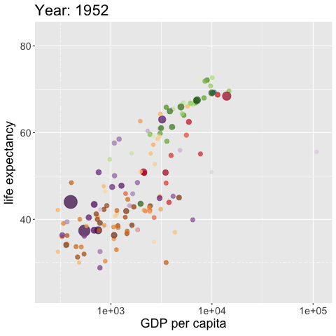
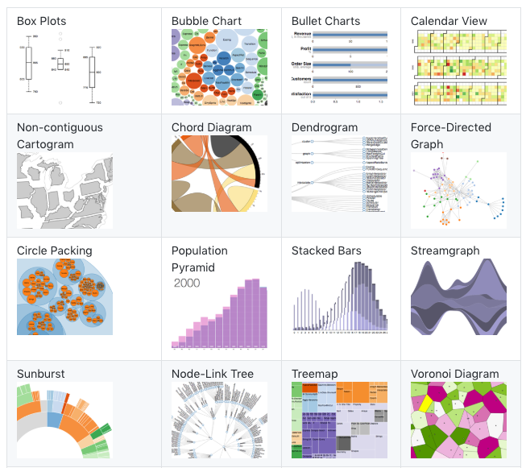

## Course Schedule

<iframe
  src="https://geo511.wilsonlab.io/Schedule.html"
  width="100%" height="800">
</iframe>
[source](https://geo511.wilsonlab.io/Schedule.html)

## Datacamp

Many people behind on DataCamp Courses.

Questions? Concerns?


## Resource Presentations


## Case Study Presentations -  Let's pick a winner!

<iframe src="https://wheelofnames.com/asw-7nk" width="100%" height="500"> </iframe>


## Next Week's Case Study

<iframe src="http://geo511.wilsonlab.io/CS_12.html" width="100%" height="800">

</iframe>

[source](http://geo511.wilsonlab.io/CS_12.html)

# HTML Visualization

## DataTables

[DataTables](http://rstudio.github.io/DT/) display R data frames as interactive HTML tables (with filtering, pagination, sorting, and search). This is a great way to make your raw data viewable without using too much space.

Don't use for large datasets in your website, though! (Any idea why?)


``` r
library(widgetframe)
library(DT)
datatable(iris, options = list(pageLength = 5)) %>% 
  frameableWidget()
```

```{=html}
<div class="datatables html-widget html-fill-item" id="htmlwidget-57b27acb67bc6611784d" style="width:100%;height:auto;"></div>
<script>HTMLWidgets.pymChild = new pym.Child();HTMLWidgets.addPostRenderHandler(function(){
                                setTimeout(function(){HTMLWidgets.pymChild.sendHeight();},100);
                            });</script>
<script type="application/json" data-for="htmlwidget-57b27acb67bc6611784d">{"x":{"filter":"none","vertical":false,"data":[["1","2","3","4","5","6","7","8","9","10","11","12","13","14","15","16","17","18","19","20","21","22","23","24","25","26","27","28","29","30","31","32","33","34","35","36","37","38","39","40","41","42","43","44","45","46","47","48","49","50","51","52","53","54","55","56","57","58","59","60","61","62","63","64","65","66","67","68","69","70","71","72","73","74","75","76","77","78","79","80","81","82","83","84","85","86","87","88","89","90","91","92","93","94","95","96","97","98","99","100","101","102","103","104","105","106","107","108","109","110","111","112","113","114","115","116","117","118","119","120","121","122","123","124","125","126","127","128","129","130","131","132","133","134","135","136","137","138","139","140","141","142","143","144","145","146","147","148","149","150"],[5.1,4.9,4.7,4.6,5,5.4,4.6,5,4.4,4.9,5.4,4.8,4.8,4.3,5.8,5.7,5.4,5.1,5.7,5.1,5.4,5.1,4.6,5.1,4.8,5,5,5.2,5.2,4.7,4.8,5.4,5.2,5.5,4.9,5,5.5,4.9,4.4,5.1,5,4.5,4.4,5,5.1,4.8,5.1,4.6,5.3,5,7,6.4,6.9,5.5,6.5,5.7,6.3,4.9,6.6,5.2,5,5.9,6,6.1,5.6,6.7,5.6,5.8,6.2,5.6,5.9,6.1,6.3,6.1,6.4,6.6,6.8,6.7,6,5.7,5.5,5.5,5.8,6,5.4,6,6.7,6.3,5.6,5.5,5.5,6.1,5.8,5,5.6,5.7,5.7,6.2,5.1,5.7,6.3,5.8,7.1,6.3,6.5,7.6,4.9,7.3,6.7,7.2,6.5,6.4,6.8,5.7,5.8,6.4,6.5,7.7,7.7,6,6.9,5.6,7.7,6.3,6.7,7.2,6.2,6.1,6.4,7.2,7.4,7.9,6.4,6.3,6.1,7.7,6.3,6.4,6,6.9,6.7,6.9,5.8,6.8,6.7,6.7,6.3,6.5,6.2,5.9],[3.5,3,3.2,3.1,3.6,3.9,3.4,3.4,2.9,3.1,3.7,3.4,3,3,4,4.4,3.9,3.5,3.8,3.8,3.4,3.7,3.6,3.3,3.4,3,3.4,3.5,3.4,3.2,3.1,3.4,4.1,4.2,3.1,3.2,3.5,3.6,3,3.4,3.5,2.3,3.2,3.5,3.8,3,3.8,3.2,3.7,3.3,3.2,3.2,3.1,2.3,2.8,2.8,3.3,2.4,2.9,2.7,2,3,2.2,2.9,2.9,3.1,3,2.7,2.2,2.5,3.2,2.8,2.5,2.8,2.9,3,2.8,3,2.9,2.6,2.4,2.4,2.7,2.7,3,3.4,3.1,2.3,3,2.5,2.6,3,2.6,2.3,2.7,3,2.9,2.9,2.5,2.8,3.3,2.7,3,2.9,3,3,2.5,2.9,2.5,3.6,3.2,2.7,3,2.5,2.8,3.2,3,3.8,2.6,2.2,3.2,2.8,2.8,2.7,3.3,3.2,2.8,3,2.8,3,2.8,3.8,2.8,2.8,2.6,3,3.4,3.1,3,3.1,3.1,3.1,2.7,3.2,3.3,3,2.5,3,3.4,3],[1.4,1.4,1.3,1.5,1.4,1.7,1.4,1.5,1.4,1.5,1.5,1.6,1.4,1.1,1.2,1.5,1.3,1.4,1.7,1.5,1.7,1.5,1,1.7,1.9,1.6,1.6,1.5,1.4,1.6,1.6,1.5,1.5,1.4,1.5,1.2,1.3,1.4,1.3,1.5,1.3,1.3,1.3,1.6,1.9,1.4,1.6,1.4,1.5,1.4,4.7,4.5,4.9,4,4.6,4.5,4.7,3.3,4.6,3.9,3.5,4.2,4,4.7,3.6,4.4,4.5,4.1,4.5,3.9,4.8,4,4.9,4.7,4.3,4.4,4.8,5,4.5,3.5,3.8,3.7,3.9,5.1,4.5,4.5,4.7,4.4,4.1,4,4.4,4.6,4,3.3,4.2,4.2,4.2,4.3,3,4.1,6,5.1,5.9,5.6,5.8,6.6,4.5,6.3,5.8,6.1,5.1,5.3,5.5,5,5.1,5.3,5.5,6.7,6.9,5,5.7,4.9,6.7,4.9,5.7,6,4.8,4.9,5.6,5.8,6.1,6.4,5.6,5.1,5.6,6.1,5.6,5.5,4.8,5.4,5.6,5.1,5.1,5.9,5.7,5.2,5,5.2,5.4,5.1],[0.2,0.2,0.2,0.2,0.2,0.4,0.3,0.2,0.2,0.1,0.2,0.2,0.1,0.1,0.2,0.4,0.4,0.3,0.3,0.3,0.2,0.4,0.2,0.5,0.2,0.2,0.4,0.2,0.2,0.2,0.2,0.4,0.1,0.2,0.2,0.2,0.2,0.1,0.2,0.2,0.3,0.3,0.2,0.6,0.4,0.3,0.2,0.2,0.2,0.2,1.4,1.5,1.5,1.3,1.5,1.3,1.6,1,1.3,1.4,1,1.5,1,1.4,1.3,1.4,1.5,1,1.5,1.1,1.8,1.3,1.5,1.2,1.3,1.4,1.4,1.7,1.5,1,1.1,1,1.2,1.6,1.5,1.6,1.5,1.3,1.3,1.3,1.2,1.4,1.2,1,1.3,1.2,1.3,1.3,1.1,1.3,2.5,1.9,2.1,1.8,2.2,2.1,1.7,1.8,1.8,2.5,2,1.9,2.1,2,2.4,2.3,1.8,2.2,2.3,1.5,2.3,2,2,1.8,2.1,1.8,1.8,1.8,2.1,1.6,1.9,2,2.2,1.5,1.4,2.3,2.4,1.8,1.8,2.1,2.4,2.3,1.9,2.3,2.5,2.3,1.9,2,2.3,1.8],["setosa","setosa","setosa","setosa","setosa","setosa","setosa","setosa","setosa","setosa","setosa","setosa","setosa","setosa","setosa","setosa","setosa","setosa","setosa","setosa","setosa","setosa","setosa","setosa","setosa","setosa","setosa","setosa","setosa","setosa","setosa","setosa","setosa","setosa","setosa","setosa","setosa","setosa","setosa","setosa","setosa","setosa","setosa","setosa","setosa","setosa","setosa","setosa","setosa","setosa","versicolor","versicolor","versicolor","versicolor","versicolor","versicolor","versicolor","versicolor","versicolor","versicolor","versicolor","versicolor","versicolor","versicolor","versicolor","versicolor","versicolor","versicolor","versicolor","versicolor","versicolor","versicolor","versicolor","versicolor","versicolor","versicolor","versicolor","versicolor","versicolor","versicolor","versicolor","versicolor","versicolor","versicolor","versicolor","versicolor","versicolor","versicolor","versicolor","versicolor","versicolor","versicolor","versicolor","versicolor","versicolor","versicolor","versicolor","versicolor","versicolor","versicolor","virginica","virginica","virginica","virginica","virginica","virginica","virginica","virginica","virginica","virginica","virginica","virginica","virginica","virginica","virginica","virginica","virginica","virginica","virginica","virginica","virginica","virginica","virginica","virginica","virginica","virginica","virginica","virginica","virginica","virginica","virginica","virginica","virginica","virginica","virginica","virginica","virginica","virginica","virginica","virginica","virginica","virginica","virginica","virginica","virginica","virginica","virginica","virginica","virginica","virginica"]],"container":"<table class=\"display\">\n  <thead>\n    <tr>\n      <th> <\/th>\n      <th>Sepal.Length<\/th>\n      <th>Sepal.Width<\/th>\n      <th>Petal.Length<\/th>\n      <th>Petal.Width<\/th>\n      <th>Species<\/th>\n    <\/tr>\n  <\/thead>\n<\/table>","options":{"pageLength":5,"columnDefs":[{"className":"dt-right","targets":[1,2,3,4]},{"orderable":false,"targets":0},{"name":" ","targets":0},{"name":"Sepal.Length","targets":1},{"name":"Sepal.Width","targets":2},{"name":"Petal.Length","targets":3},{"name":"Petal.Width","targets":4},{"name":"Species","targets":5}],"order":[],"autoWidth":false,"orderClasses":false,"lengthMenu":[5,10,25,50,100]}},"evals":[],"jsHooks":[]}</script>
```

## Leaflet

[Leaflet](http://rstudio.github.io/leaflet/) is a really powerful JavaScript library for creating dynamic maps that support panning and zooming along with various annotations like markers, polygons, and popups.


``` r
library(leaflet)
library(ggmap)
m <- leaflet() %>% setView(lng = -78.88642, lat = 42.89606, zoom = 12) %>%   addTiles()
```

Most HTML outputs will need to be run with `frameWidget()` to appear in a rmarkdown/quarto document. Simply wrap the output with:


``` r
frameWidget(m,height =500)
```

------------------------------------------------------------------------


```{=html}
<div id="htmlwidget-870f70a063a3efc5b10b" style="width:100%;height:500px;" class="widgetframe html-widget"></div>
<script type="application/json" data-for="htmlwidget-870f70a063a3efc5b10b">{"x":{"url":"widgets/widget_unnamed-chunk-6.html","options":{"xdomain":"*","allowfullscreen":false,"lazyload":false}},"evals":[],"jsHooks":[]}</script>
```

## dygraphs

Provides rich facilities for charting time-series data in R, including highly configurable series- and axis-display and interactive features like zoom/pan and series/point highlighting.


``` r
library(dygraphs)
dy1=dygraph(nhtemp, main = "New Haven Temperatures",height = 75) %>% 
  dyRangeSelector(dateWindow = c("1920-01-01", "1960-01-01"))
```

------------------------------------------------------------------------


```{=html}
<div id="htmlwidget-e0a2fb279493b2f6b7dc" style="width:100%;height:400px;" class="widgetframe html-widget"></div>
<script type="application/json" data-for="htmlwidget-e0a2fb279493b2f6b7dc">{"x":{"url":"widgets/widget_unnamed-chunk-8.html","options":{"xdomain":"*","allowfullscreen":false,"lazyload":false}},"evals":[],"jsHooks":[]}</script>
```

## rthreejs

Create interactive 3D scatter plots, network plots, and globes using the ['three.js' visualization library](https://threejs.org).


``` r
#devtools::install_github("bwlewis/rthreejs")
library(threejs)
z <- seq(-10, 10, 0.1)
x <- cos(z)
y <- sin(z)
js3=scatterplot3js(x, y, z, color=rainbow(length(z)))
```

------------------------------------------------------------------------


```{=html}
<div id="htmlwidget-ec4db45e11600c6edc10" style="width:100%;height:500px;" class="widgetframe html-widget"></div>
<script type="application/json" data-for="htmlwidget-ec4db45e11600c6edc10">{"x":{"url":"widgets/widget_unnamed-chunk-10.html","options":{"xdomain":"*","allowfullscreen":false,"lazyload":false}},"evals":[],"jsHooks":[]}</script>
```

## Steamgraph


``` r
#devtools::install_github("hrbrmstr/streamgraph")
library(streamgraph)
 
# Create data:
data <- data.frame(
  year=rep(seq(1990,2016) , each=10),
  name=rep(letters[1:10] , 27),
  value=sample( seq(0,1,0.0001) , 270)
)
 
# Stream graph with a legend
pp <- streamgraph(data, key="name", value="value", date="year", height="300px", width="1000px") %>%
  sg_legend(show=TRUE, label="names: ")
```

------------------------------------------------------------------------


```
## Warning in widget_html(name, package, id = x$id, style = css(width =
## validateCssUnit(sizeInfo$width), : streamgraph_html returned an object of class
## `list` instead of a `shiny.tag`.
```

```
## Warning: `bindFillRole()` only works on htmltools::tag() objects (e.g., div(),
## p(), etc.), not objects of type 'list'.
```

```{=html}
<div id="htmlwidget-fdfe50037ed01e4e3eb9" style="width:100%;height:500px;" class="widgetframe html-widget"></div>
<script type="application/json" data-for="htmlwidget-fdfe50037ed01e4e3eb9">{"x":{"url":"widgets/widget_unnamed-chunk-12.html","options":{"xdomain":"*","allowfullscreen":false,"lazyload":false}},"evals":[],"jsHooks":[]}</script>
```

## networkD3

Creates 'D3' 'JavaScript' network, tree, dendrogram, and Sankey graphs from 'R'.


``` r
library(igraph)
library(networkD3)
```

## Load example network

This loads an example social network of friendships between 34 members of a karate club at a US university in the 1970s. See W. W. Zachary, An information flow model for conflict and fission in small groups, Journal of Anthropological Research 33, 452-473 (1977).


``` r
karate <- make_graph("Zachary")
wc <- cluster_walktrap(karate)
members <- membership(wc)

# Convert to object suitable for networkD3
karate_d3 <- igraph_to_networkD3(karate, group = members)

n3d=forceNetwork(Links = karate_d3$links, Nodes = karate_d3$nodes,
             Source = 'source', Target = 'target', NodeID = 'name',
             Group = 'group')
```

## Force directed network plot


```{=html}
<div id="htmlwidget-e3ecda8dc4f8f96d92a7" style="width:100%;height:500px;" class="widgetframe html-widget"></div>
<script type="application/json" data-for="htmlwidget-e3ecda8dc4f8f96d92a7">{"x":{"url":"widgets/widget_unnamed-chunk-15.html","options":{"xdomain":"*","allowfullscreen":false,"lazyload":false}},"evals":[],"jsHooks":[]}</script>
```

## Sankey Network graph

Sankey diagrams are flow diagrams in which the width of the arrows is shown proportionally to the flow quantity.


``` r
# Load energy projection data
library(jsonlite)
URL <- paste0(
        "https://cdn.rawgit.com/christophergandrud/networkD3/",
        "master/JSONdata/energy.json")
Energy <- fromJSON(URL)

sn1=sankeyNetwork(Links = Energy$links, Nodes = Energy$nodes, Source = "source",
             Target = "target", Value = "value", NodeID = "name",
             units = "TWh", fontSize = 12, nodeWidth = 30)
```

------------------------------------------------------------------------


```{=html}
<div id="htmlwidget-8621067017218492f912" style="width:100%;height:500px;" class="widgetframe html-widget"></div>
<script type="application/json" data-for="htmlwidget-8621067017218492f912">{"x":{"url":"widgets/widget_unnamed-chunk-17.html","options":{"xdomain":"*","allowfullscreen":false,"lazyload":false}},"evals":[],"jsHooks":[]}</script>
```

## Radial Network


``` r
URL <- "https://raw.githubusercontent.com/christophergandrud/networkD3/master/JSONdata/flare.json"
## Convert to list format
Flare <- jsonlite::fromJSON(URL, simplifyDataFrame = FALSE)
# Use subset of data for more readable diagram
Flare$children = Flare$children[1:3]

rn1=radialNetwork(List = Flare, fontSize = 10, opacity = 0.9, height = 400, width=400)
```

------------------------------------------------------------------------


```{=html}
<div id="htmlwidget-03c6c054c6264859c6e9" style="width:100%;height:500px;" class="widgetframe html-widget"></div>
<script type="application/json" data-for="htmlwidget-03c6c054c6264859c6e9">{"x":{"url":"widgets/widget_unnamed-chunk-19.html","options":{"xdomain":"*","allowfullscreen":false,"lazyload":false}},"evals":[],"jsHooks":[]}</script>
```

## Diagonal Network


``` r
dn1=diagonalNetwork(List = Flare, fontSize = 10, 
                    opacity = 0.9, height = 400, width=400)

frameWidget(dn1,height =500)
```

```{=html}
<div id="htmlwidget-29c9c66207faf33e5c70" style="width:100%;height:500px;" class="widgetframe html-widget"></div>
<script type="application/json" data-for="htmlwidget-29c9c66207faf33e5c70">{"x":{"url":"widgets/widget_unnamed-chunk-20.html","options":{"xdomain":"*","allowfullscreen":false,"lazyload":false}},"evals":[],"jsHooks":[]}</script>
```

## gganimate


``` r
library(ggplot2)
library(gganimate)
library(gapminder)

p <- ggplot(gapminder, aes(gdpPercap, lifeExp, size = pop, colour = country)) +
  geom_point(alpha = 0.7, show.legend = FALSE) +
  scale_colour_manual(values = country_colors) +
  scale_size(range = c(2, 12)) +
  scale_x_log10() +
  labs(title = "Year: {frame_time}", x = "GDP per capita", y = "life expectancy")

anim <- p + transition_time(year) +
  ease_aes("linear")

anim_save("pres/gganimate-1.gif", anim)
```



## GGplotly

<iframe src="https://plotly.com/ggplot2/" width="100%" height="800">

</iframe>

[source](https://plotly.com/ggplot2/)

## Flexdashboard

<iframe src="https://rmarkdown.rstudio.com/flexdashboard/" width="100%" height="800">

</iframe>

[source](https://rmarkdown.rstudio.com/flexdashboard/)

## Shiny

<iframe src="https://shiny.posit.co/r/gallery/" width="100%" height="800">

</iframe>

[source](https://shiny.posit.co/r/gallery/)

## Other D3 Visualizations

[https://observablehq.com/\@d3/gallery](https://observablehq.com/@d3/gallery) 

## Data to Viz

<iframe src="https://www.data-to-viz.com/#explore" width="100%" height="800">

</iframe>

[source](https://www.data-to-viz.com/#explore)
