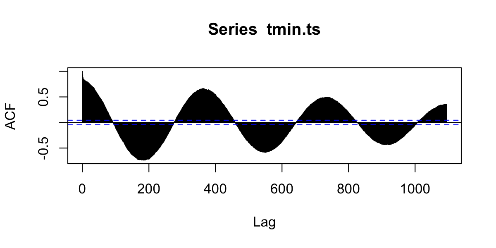
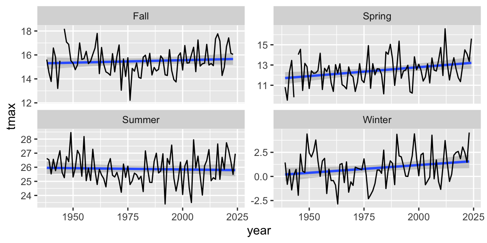

## Course Schedule

<iframe
  src="https://geo511.wilsonlab.io/Schedule.html"
  width="100%" height="800">
</iframe>
[source](https://geo511.wilsonlab.io/Schedule.html)


## Final Projects

* Only 9 folks have published their sites...
* Start moving your project proposal content into your website
  * Title
  * Introduction
  * etc...


## Resource Presentations


## Case Study Presentations -  Let's pick a winner!

<iframe src="https://wheelofnames.com/asw-7nk" width="100%" height="500"> </iframe>


## Next Week's Case Study

<iframe
  src="http://geo511.wilsonlab.io/CS_09.html"
  width="100%" height="800">
</iframe>
[source](http://geo511.wilsonlab.io/CS_09.html)


# API

## Application Programming Interface

<iframe src="https://en.wikipedia.org/wiki/Application_programming_interface" width=100% height=400px></iframe>

> - Imagine I wanted to work with Wikipedia content...

## Manually processing information from the web

* Browse to page, `File->Save As`, repeat.
* Deal with ugly html stuff...

```{}
<!DOCTYPE html>
<html>
<head>
  <meta charset="utf-8">
  <meta name="generator" content="pandoc">
  <title>APIs, time-series, and weather Data</title>
  <meta name="apple-mobile-web-app-capable" content="yes">
  <meta name="apple-mobile-web-app-status-bar-style" content="black-translucent">
  <meta name="viewport" content="width=device-width, initial-scale=1.0, maximum-scale=1.0, user-scalable=no, minimal-ui">
  <link rel="stylesheet" href="externals/reveal.js-3.3.0.1/css/reveal.css"/>
```

---


``` r
library(WikipediR)
library(tidyverse)

content=page_content(
  page_name = "API",
  project="Wikipedia",
  language="en",
  as_wikitext=T)
```

## APIs allow direct (and often custom) sharing of data

``` r
c1=content$parse$wikitext%>%
  str_split(boundary("sentence"),simplify = T)%>%
  str_replace_all("'","")%>%
  str_replace_all("\\[|\\]","")
# results:
cat(c1[5:6])
```

```
## 
##  An application programming interface (API) is a connection between computers or between computer programs.
```

## Many data providers now have APIs

* Government Demographic data (census, etc.)
* Government Environmental data
* Google, Twitter, etc.

## ROpenSci

<iframe
  src="https://ropensci.org"
  width="100%" height="800">
</iframe>
[source](https://ropensci.org)


## Pros & Cons

### Pros
* Get the data you want, when you want it
* Automatic updates - just re-run the request

### Cons
* Dependent on real-time access
* APIs, permissions, etc. can change and break code

## Generic API Access
1. Provide R with a URL to request information
2. The API sends you back a response
    * JavaScript Object Notation (JSON)
    * Extensible Markup Language (XML). 
    

``` r
library(tidyverse)
library(httr)
library(jsonlite)
```

## Endpoints
The URL you will request information from. 

* Data.gov API: https://www.data.gov/developers/apis
* Github API: https://api.github.com
* U.S. Census API:  http://api.census.gov


## Some R Packages for specific APIs

## Census data

``` r
library(tidycensus)

net_migration <- get_estimates(geography = "county",
                               variables = "RNETMIG",
                               geometry = TRUE) %>% 
                               tigris::shift_geometry()


net_migration <- net_migration %>%
  mutate(groups = case_when(
    value > 15 ~ "+15 and up",
    value > 5 ~ "+5 to +15",
    value > -5 ~ "-5 to +5",
    value > -15 ~ "-15 to -5",
    TRUE ~ "-15 and below"
  ))
```

## Results

``` r
ggplot() +
  geom_sf(data = net_migration, aes(fill = groups, color = groups), lwd = 0.1) +
  geom_sf(data = tidycensus::state_laea, fill = NA, color = "black", lwd = 0.1) +
  scale_fill_brewer(palette = "PuOr", direction = -1) +
  scale_color_brewer(palette = "PuOr", direction = -1, guide = "none") +
  coord_sf() +
  labs(title = "Net migration per 1000 residents by county",
       subtitle = "US Census Bureau 2017 Population Estimates",
       fill = "Rate",
       caption = "Data acquired with the R tidycensus package")
```

```
## old-style crs object detected; please recreate object with a recent sf::st_crs()
```

<!-- -->


## Agricultural Data


``` r
library(rnassqs)
#nassqs_auth("<your api key>")

df <- nassqs_acres(
  commodity_desc = "CORN",
  year=2000:2024,
  county_name = "Erie",
  agg_level_desc = "COUNTY",
  state_alpha = c("NY"),
  statisticcat_desc = "AREA") %>% 
  filter(short_desc=="CORN - ACRES PLANTED") %>% 
  dplyr::select(year, Value) %>%
  transmute(
    year = as.numeric(gsub(",", "", year)),
    value = as.numeric(gsub(",", "", Value)))
```


## Results

<!-- -->


## `geocode` in ggmap package useful for geocoding place names 
Geocodes a location (find latitude and longitude) using either (1) the Data Science Toolkit (http://www.datasciencetoolkit.org/about) or (2) Google Maps. 


``` r
geocode("University at Buffalo, NY")
```

```
## # A tibble: 1 × 2
##     lon   lat
##   <dbl> <dbl>
## 1 -78.8  43.0
```

---

However, you have to be careful:

``` r
geocode("Washington")
```

```
## # A tibble: 1 × 2
##     lon   lat
##   <dbl> <dbl>
## 1 -77.0  38.9
```

``` r
geocode("Washington D.C.")
```

```
## # A tibble: 1 × 2
##     lon   lat
##   <dbl> <dbl>
## 1 -77.0  38.9
```

---

But this is pretty safe for well known and well-defined places.

``` r
UB=geocode("University at Buffalo, Buffalo, NY") |>
  st_as_sf(coords=c(1,2)) |> #convert to sf
  st_set_crs("+proj=longlat +ellps=WGS84 +datum=WGS84 +no_defs") |>
  st_transform(32617) |> #transform to UTM
  st_buffer(dist= 20000) |>  #radius of buffer in decimal degrees
  st_transform(4326) #transform back to longlat
```

### Plot a leaflet map with this buffer

``` r
library(leaflet)
leaflet() %>%
  addTiles() %>%
  addPolygons(data=UB) %>% 
  addMarkers(data=st_centroid(UB))
```

```{=html}
<div class="leaflet html-widget html-fill-item" id="htmlwidget-1160bd69caa7e0f867e9" style="width:1200px;height:600px;"></div>
<script type="application/json" data-for="htmlwidget-1160bd69caa7e0f867e9">{"x":{"options":{"crs":{"crsClass":"L.CRS.EPSG3857","code":null,"proj4def":null,"projectedBounds":null,"options":{}}},"calls":[{"method":"addTiles","args":["https://{s}.tile.openstreetmap.org/{z}/{x}/{y}.png",null,null,{"minZoom":0,"maxZoom":18,"tileSize":256,"subdomains":"abc","errorTileUrl":"","tms":false,"noWrap":false,"zoomOffset":0,"zoomReverse":false,"opacity":1,"zIndex":1,"detectRetina":false,"attribution":"&copy; <a href=\"https://openstreetmap.org/copyright/\">OpenStreetMap<\/a>,  <a href=\"https://opendatacommons.org/licenses/odbl/\">ODbL<\/a>"}]},{"method":"addPolygons","args":[[[[{"lng":[-78.54435681273958,-78.54506782968036,-78.54644831090812,-78.54849417441356,-78.55119952426311,-78.55455666989346,-78.55855615017651,-78.56318676215638,-78.56843559435006,-78.57428806449312,-78.58072796160218,-78.58773749221739,-78.59529733067924,-78.60338667328705,-78.61198329617851,-78.62106361676362,-78.63060275854016,-78.64057461911162,-78.65095194122429,-78.66170638663493,-78.67280861261611,-78.68422835090279,-78.6959344888804,-78.70789515281068,-78.72007779289004,-78.73244926993164,-78.74497594346116,-78.75762376101385,-78.7703583484189,-78.78314510085656,-78.7959492744714,-78.8087360783252,-78.82147076647216,-78.83411872993848,-78.84664558838909,-78.85901728126365,-78.87120015816539,-78.8831610682861,-78.89486744865232,-78.90628741097885,-78.91738982691702,-78.92814441148758,-78.93852180448994,-78.94849364968189,-78.95803267152763,-78.96711274931447,-78.97570898844266,-78.98379778869729,-78.99135690931534,-78.9983655306665,-79.00480431237186,-79.01065544769082,-79.01590271401341,-79.02053151930225,-79.02452894433654,-79.02788378061881,-79.03058656381437,-79.03262960260295,-79.0340070028326,-79.03471468687661,-79.03475040810594,-79.03411376040181,-79.03280618264586,-79.03083095813842,-79.02819320890981,-79.02489988490305,-79.02095974802238,-79.01638335105619,-79.0111830114993,-79.00537278031491,-78.99896840569343,-78.99198729188122,-78.98444845316874,-78.97637246314508,-78.96778139934084,-78.95869878339904,-78.94914951692941,-78.93915981321693,-78.92875712497167,-78.91797006832124,-78.90682834326238,-78.89536265080099,-78.883604607024,-78.87158665435761,-78.85934197027862,-78.84690437375491,-78.83430822970143,-78.82158835174512,-78.80877990359957,-78.79591829935633,-78.78303910300328,-78.77017792748435,-78.75737033361672,-78.74465172918127,-78.73205726850267,-78.71962175283166,-78.70737953184016,-78.6953644065339,-78.68360953388205,-78.67214733345571,-78.66100939635895,-78.65022639672647,-78.63982800605177,-78.62984281059789,-78.62029823213088,-78.61122045220259,-78.60263434019593,-78.59456338533123,-78.58702963281682,-78.58005362431251,-78.57365434285775,-78.56784916240088,-78.56265380204952,-78.5580822851456,-78.55414690325212,-78.55085818512296,-78.54822487071027,-78.54625389024831,-78.54495034843691,-78.54431751373254,-78.54435681273958],"lat":[42.99681098038584,42.98740104702304,42.97803129045946,42.96872736119305,42.95951471824875,42.9504185598786,42.9414637550906,42.93267477618728,42.9240756324908,42.91568980542716,42.90754018513737,42.89964900877891,42.89203780067456,42.88472731446111,42.87773747738383,42.87108733687664,42.86479500956141,42.85887763279349,42.85335131887324,42.84823111203637,42.84353094832914,42.83926361846635,42.83544073376289,42.83207269522203,42.82916866585527,42.82673654630141,42.82478295380366,42.82331320459608,42.82233129974212,42.82183991445995,42.82184039096068,42.82233273481751,42.82331561487526,42.82478636670131,42.8267409995707,42.82917420696941,42.8320793805917,42.83544862779881,42.83927279249808,42.84354147939319,42.84824308154744,42.85336481119516,42.85889273372639,42.86481180476343,42.87110591023936,42.87775790938068,42.88474968048904,42.89206216940933,42.89967544056395,42.90756873042637,42.91572050329985,42.92410850926076,42.93270984411949,42.94150101124576,42.9504579850995,42.95955627630278,42.96877099808308,42.97807693391387,42.9874486061733,42.99686034563832,43.00628636162821,43.01570081260748,43.02507787705649,43.03439182441549,43.04361708590608,43.05272832503326,43.06170050757085,43.07050897083262,43.07912949203264,43.08753835553939,43.09571241882997,43.10362917695355,43.11126682531594,43.11860432060141,43.12562143965159,43.13229883612737,43.13861809478427,43.1445617831987,43.15011350078954,43.15525792498629,43.15998085440369,43.16426924889134,43.16811126633536,43.17149629609921,43.17441498900116,43.17685928373537,43.1788224296556,43.18029900585069,43.18128493645325,43.18177750213418,43.18177534774791,43.18127848610501,43.18028829786125,43.17880752752417,43.17684027559049,43.17439198683984,43.17146943482214,43.16808070258808,43.16423515972322,43.15994343575849,43.15521739003973,43.15007007815066,43.14451571499346,43.13856963464083,43.13224824708345,43.12556899200475,43.11855028972434,43.11121148945813,43.10357281505134,43.09565530834708,43.08748077035831,43.07907170041837,43.0704512334876,43.06164307580033,43.05267143903794,43.04356097321802,43.03433669849147,43.02502393604109,43.01564823827664,43.0062353185214,42.99681098038584]}]]],null,null,{"interactive":true,"className":"","stroke":true,"color":"#03F","weight":5,"opacity":0.5,"fill":true,"fillColor":"#03F","fillOpacity":0.2,"smoothFactor":1,"noClip":false},null,null,null,{"interactive":false,"permanent":false,"direction":"auto","opacity":1,"offset":[0,0],"textsize":"10px","textOnly":false,"className":"","sticky":true},null]},{"method":"addMarkers","args":[43.00180847101827,-78.78953476048817,null,null,null,{"interactive":true,"draggable":false,"keyboard":true,"title":"","alt":"","zIndexOffset":0,"opacity":1,"riseOnHover":false,"riseOffset":250},null,null,null,null,null,{"interactive":false,"permanent":false,"direction":"auto","opacity":1,"offset":[0,0],"textsize":"10px","textOnly":false,"className":"","sticky":true},null]}],"limits":{"lat":[42.82183991445995,43.18177750213418],"lng":[-79.03475040810594,-78.54431751373254]}},"evals":[],"jsHooks":[]}</script>
```


## `FedData` package

* National Elevation Dataset digital elevation models (1 and 1/3 arc-second; USGS)
* National Hydrography Dataset (USGS)
* Soil Survey Geographic (SSURGO) database 
* International Tree Ring Data Bank.
* Global Historical Climatology Network (GHCN)
* Others

## Load `FedData` and define a study area

``` r
# devtools::install_github("ropensci/FedData")
library(FedData)
library(terra)
library(tidyverse)
```

### USGS National Elevation Dataset

``` r
# Get the NED (USA ONLY)
# Returns a raster
NED <- get_ned(
  template = UB,
  label = "UB",res = 13
)
```

---


``` r
library(rasterVis)

gplot(NED)+
  geom_raster(aes(fill=value))+
  scale_fill_viridis_c()+
  geom_sf(data=UB,inherit.aes = F,fill="transparent",col="red")+
  geom_sf(data=st_centroid(UB),inherit.aes = F,fill="transparent",col="red")
```

<!-- -->

---

### ORNL Daymet

``` r
# Get the DAYMET (North America only)
# Returns a raster
DAYMET <- get_daymet(
  template = UB,
  label = "UB",
  elements = c("tmax"),
  years = 2023:2023
) 
```
---


``` r
gplot(DAYMET$tmax[[1:10]])+
  geom_raster(aes(fill=value))+
  facet_wrap(~variable)+
  scale_fill_viridis_c()+
  geom_sf(data=st_transform(UB,crs(DAYMET$tmax)),inherit.aes = F,fill="transparent",col="red")+
  labs(title="Daymet Maximum Temperature")
```

<!-- -->

---

### NOAA GHCN-daily

``` r
# Get the daily GHCN data (GLOBAL)
# Returns a list: the first element is the spatial locations of stations,
# and the second is a list of the stations and their daily data
GHCN.tmax <- get_ghcn_daily(
  template = UB,
  label = "UB",
  elements = c("tmax")
)

tmax <- GHCN.tmax$spatial %>%
  dplyr::mutate(label = paste0(ID, ": ", NAME))

leaflet() %>%
  addTiles() %>%
  addMarkers(data=tmax)
```

```{=html}
<div class="leaflet html-widget html-fill-item" id="htmlwidget-1160bd69caa7e0f867e9" style="width:1200px;height:600px;"></div>
<script type="application/json" data-for="htmlwidget-1160bd69caa7e0f867e9">{"x":{"options":{"crs":{"crsClass":"L.CRS.EPSG3857","code":null,"proj4def":null,"projectedBounds":null,"options":{}}},"calls":[{"method":"addTiles","args":["https://{s}.tile.openstreetmap.org/{z}/{x}/{y}.png",null,null,{"minZoom":0,"maxZoom":18,"tileSize":256,"subdomains":"abc","errorTileUrl":"","tms":false,"noWrap":false,"zoomOffset":0,"zoomReverse":false,"opacity":1,"zIndex":1,"detectRetina":false,"attribution":"&copy; <a href=\"https://openstreetmap.org/copyright/\">OpenStreetMap<\/a>,  <a href=\"https://opendatacommons.org/licenses/odbl/\">ODbL<\/a>"}]},{"method":"addMarkers","args":[[42.85,42.9489,43.15220000000001,43.0572,43.1083,43.13330000000001,43.0856,42.9667,42.93330000000001,42.8833,42.8833],[-78.63330000000001,-78.7367,-78.6533,-78.8617,-78.93810000000001,-78.9667,-78.97190000000001,-78.9667,-78.90000000000001,-78.88330000000001,-78.9667],null,null,null,{"interactive":true,"draggable":false,"keyboard":true,"title":"","alt":"","zIndexOffset":0,"opacity":1,"riseOnHover":false,"riseOffset":250},null,null,null,null,null,{"interactive":false,"permanent":false,"direction":"auto","opacity":1,"offset":[0,0],"textsize":"10px","textOnly":false,"className":"","sticky":true},null]}],"limits":{"lat":[42.85,43.15220000000001],"lng":[-78.97190000000001,-78.63330000000001]}},"evals":[],"jsHooks":[]}</script>
```


---

### Reshape daily data

``` r
kable(head(GHCN.tmax$tabular$USW00014733$TMAX))
```


|STATION     | YEAR|MONTH |  D1|  D2|  D3|  D4|  D5|  D6|  D7|  D8|  D9| D10| D11| D12| D13| D14| D15| D16| D17| D18| D19| D20| D21| D22| D23| D24| D25| D26| D27| D28| D29| D30| D31|
|:-----------|----:|:-----|---:|---:|---:|---:|---:|---:|---:|---:|---:|---:|---:|---:|---:|---:|---:|---:|---:|---:|---:|---:|---:|---:|---:|---:|---:|---:|---:|---:|---:|---:|---:|
|USW00014733 | 1938|05    | 144| 211| 167| 206| 311| 194| 128| 161| 122| 100|  94|  89| 122| 172| 144| 183| 167| 233| 189| 206| 172| 222| 239| 128| 217| 244| 256| 244| 256| 239| 233|
|USW00014733 | 1938|06    | 261| 222| 211| 250| 200| 250| 222| 206| 217| 244| 267| 189| 228| 267| 283| 272| 222| 228| 189| 306| 317| 317| 289| 311| 294| 161| 206| 222| 256| 250|  NA|
|USW00014733 | 1938|07    | 189| 239| 228| 261| 256| 272| 300| 322| 289| 294| 261| 283| 294| 278| 217| 256| 272| 261| 283| 306| 250| 294| 261| 311| 306| 317| 294| 311| 261| 283| 278|
|USW00014733 | 1938|08    | 256| 289| 322| 300| 311| 289| 317| 306| 300| 267| 267| 250| 267| 294| 306| 317| 283| 272| 306| 311| 300| 283| 261| 228| 211| 239| 256| 250| 278| 189| 283|
|USW00014733 | 1938|09    | 183| 206| 222| 250| 178| 250| 211| 167| 183| 239| 194| 239| 228| 206| 178| 156| 200| 244| 183| 178| 144| 139| 211| 189| 217| 239| 194| 194| 139| 161|  NA|
|USW00014733 | 1938|10    | 139| 150| 178| 194| 122|  83| 144| 133| 117| 178| 228| 267| 233| 211| 228| 239| 233| 256| 222| 117|  94| 133| 194| 156| 122| 211|  83| 100| 139|  61| 122|

``` r
daily <- GHCN.tmax$tabular$USW00014733$TMAX |>
  gather(day,value,-STATION,-YEAR,-MONTH) |>
  mutate(day=str_remove(day,"D"),
         tmax=value/10,
         date=as_date(paste(YEAR,MONTH,day,sep="-"))) %>% 
  arrange(date)

kable(head(daily))
```


|STATION     | YEAR|MONTH |day | value| tmax|date       |
|:-----------|----:|:-----|:---|-----:|----:|:----------|
|USW00014733 | 1938|05    |1   |   144| 14.4|1938-05-01 |
|USW00014733 | 1938|05    |2   |   211| 21.1|1938-05-02 |
|USW00014733 | 1938|05    |3   |   167| 16.7|1938-05-03 |
|USW00014733 | 1938|05    |4   |   206| 20.6|1938-05-04 |
|USW00014733 | 1938|05    |5   |   311| 31.1|1938-05-05 |
|USW00014733 | 1938|05    |6   |   194| 19.4|1938-05-06 |

---

### Plot temperatures

``` r
ggplot(daily,
       aes(y=tmax,x=date))+
  geom_line(col="red")
```

<!-- -->

---

Limit to a few years

``` r
daily_recent=filter(daily,date>as.Date("2020-01-01"))

ggplot(daily_recent,
        aes(y=tmax,x=date))+
 geom_line(col="red")
```

<!-- -->

## Zoo package for rolling functions

Infrastructure for Regular and Irregular Time Series (Z's Ordered Observations)

* `rollmean()`:  Rolling mean
* `rollsum()`:   Rolling sum
* `rollapply()`:  Custom functions

Use rollmean to calculate a rolling 60-day average. 

* `align` whether the index of the result should be left- or right-aligned or centered

---


``` r
library(zoo)
d_rollmean = daily_recent %>% 
  arrange(date) %>%
  mutate(tmax.60 = rollmean(x = tmax, 60, align = "center", fill = NA),
         tmax.b60 = rollmean(x = tmax, 60, align = "right", fill = NA))
```

---


``` r
d_rollmean%>%
  ggplot(aes(y=tmax,x=date))+
    geom_line(col="grey")+
    geom_line(aes(y=tmax.60),col="red")+
    geom_line(aes(y=tmax.b60),col="darkred")
```

<!-- -->

# Time Series analysis

Most timeseries functions use the time series class (`ts`)


``` r
tmax.ts=ts(daily_recent$tmax,frequency = 365)
```

## Temporal autocorrelation

Values are highly correlated!


``` r
ggplot(daily_recent,aes(y=tmax,x=lag(tmax)))+
  geom_point()+
  geom_abline(intercept=0, slope=1)
```

```
## Warning: Removed 10 rows containing missing values or values outside the scale range
## (`geom_point()`).
```

<!-- -->

## Autocorrelation functions

* autocorrelation  $x$ vs. $x_{t-1}$  (lag=1)
* partial autocorrelation.  $x$  vs. $x_{n}$ _after_ controlling for correlations $\in t-1:n$

## Autocorrelation

``` r
acf(tmax.ts,lag.max = 365*3,na.action = na.exclude )
```

<!-- -->

---

### Partial Autocorrelation

``` r
pacf(tmax.ts,lag.max = 365,na.action = na.exclude )
```

<!-- -->


# Trend analysis

## Group by month, season, year, and decade.

How to convert years into 'decades'?

``` r
1938
```

```
## [1] 1938
```

``` r
round(1938,-1)
```

```
## [1] 1940
```

``` r
floor(1938/10)
```

```
## [1] 193
```

``` r
floor(1938/10)*10 
```

```
## [1] 1930
```
Now we can make a 'decade' grouping variable.

---

Calculate seasonal and decadal mean temperatures.

``` r
daily2=daily%>%
  mutate(month=as.numeric(format(date,"%m")),
        year=as.numeric(format(date,"%Y")),
        season=case_when(
          month%in%c(12,1,2)~"Winter",
          month%in%c(3,4,5)~"Spring",
          month%in%c(6,7,8)~"Summer",
          month%in%c(9,10,11)~"Fall"),
        dec=(floor(as.numeric(format(date,"%Y"))/10)*10))
daily2%>%dplyr::select(date,month,year,season,dec,tmax)%>%head()%>%kable()
```


|date       | month| year|season |  dec| tmax|
|:----------|-----:|----:|:------|----:|----:|
|1938-05-01 |     5| 1938|Spring | 1930| 14.4|
|1938-05-02 |     5| 1938|Spring | 1930| 21.1|
|1938-05-03 |     5| 1938|Spring | 1930| 16.7|
|1938-05-04 |     5| 1938|Spring | 1930| 20.6|
|1938-05-05 |     5| 1938|Spring | 1930| 31.1|
|1938-05-06 |     5| 1938|Spring | 1930| 19.4|

## Timeseries models


How to assess change? Simple differences?


``` r
daily2%>%
  mutate(period=ifelse(year<=1976-01-01,"early","late"))%>% #create two time periods before and after 1976
  group_by(period)%>%  # divide the data into the two groups
  summarize(n=n(),    # calculate the means between the two periods
            tmax=mean(tmax,na.rm=T))%>%
  kable()
```


|period |     n|     tmax|
|:------|-----:|--------:|
|early  | 13394| 13.65857|
|late   | 18202| 13.89095|
|NA     |   582|      NaN|

---

But be careful, there were missing data in the beginning of the record

``` r
daily2%>%
  group_by(year)%>%
  summarize(n=n())%>%
  ggplot(aes(x=year,y=n))+
  geom_line()
```

<!-- -->

---


``` r
# which years don't have complete data?
daily2%>%
  group_by(year)%>%
  summarize(n=n())%>%
  filter(n<360)
```

```
## # A tibble: 2 × 2
##    year     n
##   <dbl> <int>
## 1  1938   245
## 2  2024   305
```

---

Plot 10-year means (excluding years without complete data):

``` r
daily2%>%
  filter(year>1938, year<2024)%>%
  group_by(dec)%>%
  summarize(
            n=n(),
            tmax=mean(tmax,na.rm=T)
            )%>%
  ggplot(aes(x=dec,y=tmax))+
  geom_line(col="grey")
```

<!-- -->


## Look for specific events: was 2024 unusually hot in Buffalo, NY?
Let's compare 2024 with all the previous years in the dataset.  First add 'day of year' to the data to facilitate showing all years on the same plot.

``` r
df=daily2%>%
  mutate(doy=as.numeric(format(date,"%j")),
         doydate=as.Date(paste("2024-",doy),format="%Y-%j"))
```

---

Then plot all years (in grey) and add 2024 in red.

``` r
ggplot(df,aes(x=doydate,y=tmax,group=year))+
  geom_line(col="grey",alpha=.5)+ # plot each year in grey
  stat_smooth(aes(group=1),col="black")+   # Add a smooth GAM to estimate the long-term mean
  geom_line(data=filter(df,year==2024),col="red")+  # add 2023 in red
  scale_x_date(labels = date_format("%b"),date_breaks = "2 months") + 
  xlab("Day of year")
```

```
## `geom_smooth()` using method = 'gam' and formula = 'y ~ s(x, bs = "cs")'
```

<!-- -->

---

Then 'zoom' into just the past few months and add 2024 in red.

``` r
ggplot(df,aes(x=doydate,y=tmax,group=year))+
  geom_line(col="grey",alpha=.5)+
  stat_smooth(aes(group=1),col="black")+
  geom_line(data=filter(df,year==2024),col="red")+
  scale_x_date(labels = date_format("%b"),date_breaks = "2 months",
               lim=c(as.Date("2024-08-01"),as.Date("2024-10-31")))
```

<!-- -->


## Summarize by season

``` r
seasonal=daily2%>%
  group_by(year,season)%>%
  summarize(n=n(),
            tmax=mean(tmax))%>%
  filter(n>75)
```

## Seasonal Trends


``` r
seasonal |>
    filter(!is.na(season)) |>
ggplot(aes(y=tmax,x=year))+
  facet_wrap(~season,scales = "free_y")+
  stat_smooth(method="lm", se=T)+
  geom_line()
```

```
## `geom_smooth()` using formula = 'y ~ x'
```

<!-- -->

## Fit a linear model to a single season


``` r
lm1=seasonal%>%
  filter(season=="Summer")%>%
  lm(tmax~year,data=.)

summary(lm1)$r.squared
```

```
## [1] 0.002034488
```

``` r
tidy(lm1)%>%kable() 
```


|term        |   estimate| std.error|  statistic|   p.value|
|:-----------|----------:|---------:|----------:|---------:|
|(Intercept) | 29.5466595| 8.8153619|  3.3517240| 0.0012002|
|year        | -0.0018523| 0.0044496| -0.4162739| 0.6782588|

## Linear regression for _each_ season

``` r
# fit a lm model for each group
  daily2 %>%
  filter(!is.na(season)) |>
  group_by(season) %>% #process by season
  nest() %>% # cut into groups
  mutate(
    lm_tmax = purrr::map(data, .f = ~ lm(tmax ~ year, data = .)), #fit model for each group
    tmax_tidy = purrr::map(lm_tmax, broom::tidy) #summarize model for each group
  ) %>%
  unnest(tmax_tidy) %>%
  filter(term == "year") %>% 
  dplyr::select(-data, -lm_tmax) %>% 
  kable()
```


|season |term |   estimate| std.error| statistic|   p.value|
|:------|:----|----------:|---------:|---------:|---------:|
|Spring |year |  0.0155728| 0.0038701|  4.023831| 0.0000578|
|Summer |year | -0.0018523| 0.0017078| -1.084612| 0.2781264|
|Fall   |year |  0.0068981| 0.0034962|  1.973021| 0.0485281|
|Winter |year |  0.0165141| 0.0028321|  5.830986| 0.0000000|

## Autoregressive models
See [Time Series Analysis Task View](https://cran.r-project.org/web/views/TimeSeries.html) for summary of available pack,-ages/models. 

* Moving average (MA) models
* autoregressive (AR) models
* autoregressive moving average (ARMA) models
* frequency analysis
* Many, many more...
